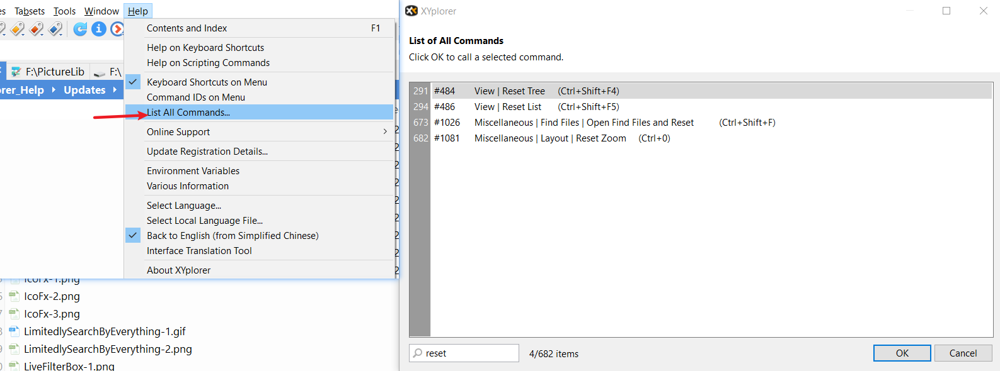

# 事先说明

1. 本文阅读最好使用Typora进行阅读，阅读时打开“大纲”功能，**选择你需要的章节阅读**。

   友情提示：下载速度慢的可以去下载一个Tampermonkey插件——[Github 增强 - 高速下载](https://greasyfork.org/en/scripts/412245-github-%E5%A2%9E%E5%BC%BA-%E9%AB%98%E9%80%9F%E4%B8%8B%E8%BD%BD)，安装后不管是clone还是下载zip都可以选择分流节点。

2. 更新频率和内容。更新时间不确定。这大概是我写过最详细的一份帮助类说明文档了，现在考虑时间投入收益，投入到这份文档上的时间只会越来越少，要是我有时间，能完善就完善吧。

3. 提问和解惑。可以Google或者参考官方帮助文档，按<kbd>F1</kbd>呼出，若无法呼出，请下载`XYplorer.chm`后置于XYplorer目录。由于深入使用XY需要有较扎实的英文基础和对计算机技术用语(Computing Glossary)比较熟悉，所以参阅英文帮助文档可能会遇到障碍，这里我提供一个翻译网站:[DeepL Translate](https://www.deepl.com/translator)。

   提问的魔法进修课:point_right:[Stop-Ask-Questions-The-Stupid-Ways](https://github.com/dogfight360/Stop-Ask-Questions-The-Stupid-Ways/blob/master/README.md)。

4. 本文参考来源主要包括Google搜索、XYplorer Beta Club、官网帮助文档。

5. 有时，为了书写方便，我会把XYplorer简称为XY。

6. 所有的图片不会放置到图床服务器上，这是为了避免图片服务器挂掉导致本项目的图片无法查看的情况，但是相应地，本项目存储大小中图片占比较大。

7. 希望引用到本文档内容的，可以说明下引用出处，尊重下作者的劳动成果。

# [Pin]下载XY

[XYplorer - 果核剥壳](https://www.ghxi.com/xyplorer-2.html)

# [Pin]如何找出需要的命令?
极大部分的功能(命令)都是可以通过"List All Commands..."进行查找和使用的！这点很重要，因为你不知道一些命令时，可以通过关键词进行搜索，从搜索结果可以推出该命令是位于哪个菜单栏中的。

我对之前的文档进行分类了，因此根据所需选择对于的Markdown进行参阅。

建议把"List All Commands..."设置快捷键为<kbd>Alt + F</kbd>，以便快速呼出。

# [Pin]请不要把第三方文件管理器作为默认文件管理器

* 一旦包含XYplorer在内的第三方文件管理器设置默认文件管理器，若将第三方文件管理器删除，那么可能会出现Windows文件管理器都用不了，在这种极端情况，只能通过<kbd>Win +R</kbd>打开运行框，并输入explorer来打开Windows文件管理器。
* 例如从迅雷中打开目录，调用的Windows文件管理器。同理，其他程序的“打开目录”不一定会调用设置为默认文件管理器的第三方文件管理器！
* 你可以把第三方文件管理器添加到任务栏，配合快捷键实现在XY特定路径下，使用Windows文件管理器打开特定目录。

# 阅读列表

| 文件                                                        | 说明                                                         |
| ----------------------------------------------------------- | ------------------------------------------------------------ |
| [快速入门XY](./XYplorer-QuickStart.md)                      | 帮助你快速上手XYplorer                                       |
| [界面布局](./XYplorer-Layout.md)                            | 主要介绍XYplorer界面上元素的使用                             |
| [用户自定义命令](./XYplorer-UDC.md)                         | 用户自定义命令的使用，主要是让快捷键绑定命令或脚本文件       |
| [标签集](./XYplorer-Tags.md)                                | 标签集的使用                                                 |
| [自定义文件关联、便携式打开方式菜单](./XYplorer-CFA_POM.md) | 指定规则后，让XYplorer中的文件可以以指定的应用进行打开       |
| [自定义文件图标](./XYplorer-CFI.md)                         | 指定规则后，让XYplorer在不同文件显示不同的个性化图标         |
| [搜索](./XYplorer-Search.md)                                | XYplorer搜索的使用                                           |
| [收藏文件和收藏文件夹](./XYplorer-Favorites.md)             | XYplorer收藏文件或收藏文件夹的使用                           |
| [备份和还原](./XYplorer-Backup_Restore.md)                  | XYplorer怎样迁移或升级到新版本，同时不让用户数据丢失         |
| [自定义事件动作](./XYplorer-XYplorer-CEA.md)                | 注意是XYplorer上鼠标的动作会触发一些事件，这里可以选择发生的事件是什么 |
| [与其他效率工具联动](./XYplorer-MatchingTools.md)           | XYplorer可以搭配哪些工具，让我们工作或学习更有效率           |
| [脚本](./XYplorer-Scripting.md)                             | 简单介绍了Scripting是什么,里面会介绍其他主题-教程会使用的一些XY内置的变量 |
| [脚本笔记](./XYplorer-ScriptingNote.md)                     | 当你需要深入了解Scripting时，XYplorer-ScriptingNote.md会为你提供一点帮助。 |
| [一些技巧](./XYplorer-Tips.md)                              | 记录一些技巧和问题的解决方法                                 |

其他阅读方式（不保证同步更新）

* 码云：[https://violet7pan.gitee.io/categories/XYplorer/](https://violet7pan.gitee.io/categories/XYplorer/)
* GitHub：[https://violet7pan.github.io/categories/XYplorer/](https://violet7pan.github.io/categories/XYplorer/)

