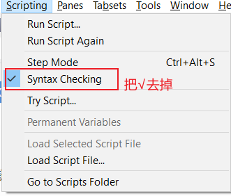
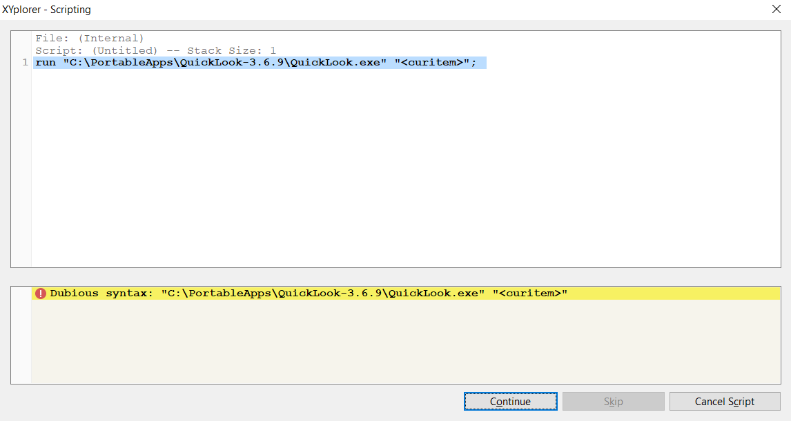

在介绍过程中，所有技巧均按XYplorer英文版进行说明，中文版的用户请自行对照。

# 20191011 

# 使用过程中出现崩溃的原因和解决方法


出现崩溃现象效果如下图


会出现一个Coffee的俯视图。

原因就两种，具体看图片红字描述。


减少或避免出现崩溃的方法

* 选中非最后一个标签页，然后新建标签页
* 尽量少用`设置(Configuration(F9))`按钮，如果要用，记得在File -> Save Setting，否则会丢失本次打开的使用记录。

# 20200311

# 在XYplorer中使用QuickLook

[QuickLook](https://github.com/QL-Win/QuickLook)  [(此处下载)](https://github.com/QL-Win/QuickLook/releases)

-具体方法如下，

1.在`你的XYplorer目录\Data\Scripts`下在创建一个`.xys`脚本文件，命名为`Run QuickLook.xys`，内容如下

```
run "你的QuickLook目录\QuickLook.exe" "<curitem>";
```

2.然后，按下图完成设置，


我这里分配的按键<kbd>Alt+1<kbd>

Script File内容如下

```
<xyscripts>\Run QuickLook.xys
```

3.最后，请关闭语法检查，具体方法如下，



若未关闭语法检查，使用QuickLook配合快捷键会出现这样的错误，



4.方法介绍完了，使用时，先选中要预览的文件，然后<kbd>Alt+1<kbd>即可。

-说明事项：

XYplorer中使用QuickLook，是否可以使用空格键？

答：QuickLook在XYplorer使用中，不能使用<kbd>Spacebar<kbd>，因为它是被XYplorer保留[[?](https://www.xyplorer.com/xyfc/viewtopic.php?t=20326)]，因而你无法在XYplorer中使用它。

参考：https://github.com/QL-Win/QuickLook/issues/96

