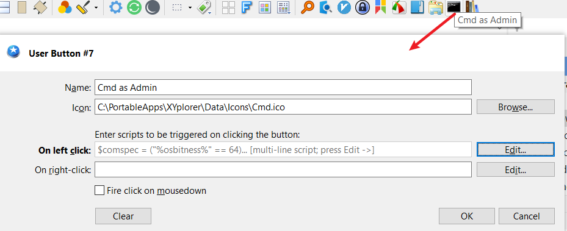
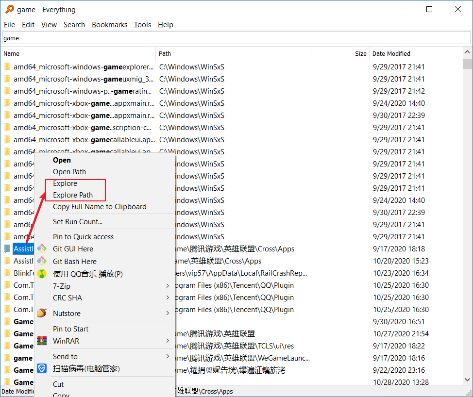

在介绍过程中，所有技巧均按XYplorer英文版进行说明，中文版的用户请自行对照。

# 20191011 

# 使用过程中出现崩溃的原因和解决方法


出现崩溃现象效果如下图


会出现一个Coffee的俯视图。

原因就两种，具体看图片红字描述。


减少或避免出现崩溃的方法

* 选中非最后一个标签页，然后新建标签页
* 尽量少用`设置(Configuration(F9))`按钮，如果要用，记得在File -> Save Setting，否则会丢失本次打开的使用记录。

# 20200311

# 在XYplorer中使用QuickLook

[QuickLook](https://github.com/QL-Win/QuickLook)  [(此处下载)](https://github.com/QL-Win/QuickLook/releases)

-具体方法如下，

1.在`你的XYplorer目录\Data\Scripts`下在创建一个`.xys`脚本文件，命名为`Run QuickLook.xys`，内容如下

```
run "你的QuickLook目录\QuickLook.exe" "<curitem>";
```

2.然后，按下图完成设置，


我这里分配的按键<kbd>Alt+1</kbd>

Script File内容如下

```
<xyscripts>\Run QuickLook.xys
```

3.最后，请关闭语法检查，具体方法如下，


若未关闭语法检查，使用QuickLook配合快捷键会出现这样的错误，


4.方法介绍完了，使用时，先选中要预览的文件，然后<kbd>Alt+1</kbd>即可。

-说明事项：

XYplorer中使用QuickLook，是否可以使用空格键？

答：QuickLook在XYplorer使用中，不能使用<kbd>Spacebar</kbd>，因为它是被XYplorer保留[[?](https://www.xyplorer.com/xyfc/viewtopic.php?t=20326)]，因而你无法在XYplorer中使用它。

参考：https://github.com/QL-Win/QuickLook/issues/96


# 按钮的高级用法 - <span id="explorer_button">[案例1]使用Windows文件管理器打开XYplorer当前路径</span>

-使用效果如下，

-具体方法如下，

1.提取图标。提取工具[IcoFX3(下载地址若失效，自行下载)](https://ghpym.lanzous.com/b00zelckd)[可选]


2.添加按钮


内容信息如下

``` 
Explorer
<xyicons>\Explorer.ico
run "C:\Windows\explorer.exe" <curpath>
```

-END

-XYplorer小知识

设当前XYplorer目录位于<code>C:\PortableApps\XYplorer</code>;设当前目录位于<code>F:\PictureLib</code>

目录结构：

```
C:\PortableApps\XYplorer>tree
Folder PATH listing for volume OS
Volume serial number is 080B-2E29
C:.
└─Data
    ├─AutoBackup
    ├─Catalogs
    ├─FindTemplates
    ├─Icons
    ├─NewItems
    │  └─New folder
    ├─Panes
    │  ├─1
    │  │  └─t
    │  └─2
    │      └─t
    ├─Paper
    ├─Scripts
    │  └─Everything
    ├─Temp
    └─Thumbnails
```


在地址栏分别输入<code>::msg \<xypath\></code>、<code>::msg \<xydata\></code>、<code>::msg \<xyicons\></code>、<code>::msg \<xyscripts\></code>、<code>::msg \<xypaper\></code>、<code>::msg \<xycatalogs\></code>、<code>::msg \<xynewitems\></code>、、<code>::msg \<curpath\></code>，结论如下，

```
<xypath> = C:\PortableApps\XYplorer
<xydata> = C:\PortableApps\XYplorer\Data
<xyicons> = C:\PortableApps\XYplorer\Data\Icons
<xyscripts> = C:\PortableApps\XYplorer\Data\Scripts
<xypaper> = C:\PortableApps\XYplorer\Data\Paper
<xycatalogs> = C:\PortableApps\XYplorer\Data\Catalogs
<xynewitems> = C:\PortableApps\XYplorer\Data\NewItems
<curpath> = F:\PictureLib
```

<code>::msg \<curname\></code>的输出需要选中一个文件，比如鼠标选中<code>F:\PictureLib\a.png</code>，那么输出

```
F:\PictureLib\a.png
```

什么都不选中，则输出空白（即什么都没有）。


# [案例2]CMD集成到按钮




按钮信息如下，

```
Cmd as Admin
<xyicons>\Cmd.ico

$comspec = ("%osbitness%" == 64) ? "%windir%\System32\cmd.exe" : "%windir%\SysWOW64\cmd.exe";
    $cscript = ("%osbitness%" == 64) ? "%windir%\System32\cscript.exe" : "%windir%\SysWOW64\cscript.exe";

    $vbsFile = "%TEMP%\~OpenElevatedCMD.vbs";

    $vbsContent = <<<>>>
        Set UAC = CreateObject("Shell.Application")
        UAC.ShellExecute "$comspec", "/k pushd ""<curpath>""", "", "runas", 1
>>>;

    writefile($vbsFile, trim($vbsContent));

    if (get("trigger") == "1") { // Left click -> Admin
        run """$cscript"" ""$vbsFile"" //nologo", , 0, 0;
    } elseif (get("trigger") == "2") { // Right click -> No admin
        run """$comspec"" /k pushd ""<curpath>""";
    }
```

按钮的添加方法在“按钮的高级用法”[[?](#explorer_button)]部分有讲到。

使用评价：

这个cmd其实也不是很好用。

偶尔我还是会<kbd>Win + R</kbd>来启动cmd，进入cmd，切换盘符（比如<code>f:</code><kbd>Enter</kbd>)，然后在XYplorer某个目录下<kbd>Alt + D</kbd> <kbd>Ctrl + C</kbd>复制路径回到cmd粘贴。

当然，你也可以先把cmd集成到Windows右键的Context中，然后[将windows右键菜单添加到XYplorer](https://zhuanlan.zhihu.com/p/70331585)。我不想折腾了，要命了。

或者，你完全可以使用XYplorer集成的Windows文件管理按钮[[?](#explorer_button)]，使用Windows自带的文件管理右键来cmd[[?](https://www.cnblogs.com/dream4567/p/10693588.html)]。


# 树的使用

树的配置主要在`View`、`Tools->Customize Tree`、`Configuration(F9)->Tree and List`，少部分可以通过键入关键字"Tree"到`Configuration(F9)->左下角Jump to Setting`进行寻找、

菜单栏`Windows->Show Tree(Shift + F8)`，打开Tree记录功能。

`View->Mini Tree`：只显示选项卡(Tab)的路径的树，由于不需要显示无关目录的树，所以速度更快。

由于Tree会记录文件浏览历史，在退出XYplorer前，`View->Reset Tree(Ctrl + Shift + F4)`，如果路径历史过多，影响加载速度。

在Tree开启的情况下，每一次浏览目录，侧边的Tree都会追踪记录，所以你可以很容易看到当前目录和历史目录的层次结构。

`Tools->Customize Tree->Tree Path Tracking`：开启树追踪标记


`View->Lock Tree`：开启后，记住（冻结为）上一次树结构的状态，接下来无论怎样浏览目录，树的追踪记录都看不到。开启期间，应该是不会有目录追踪记录的。当关闭后，恢复树的追踪记录功能，并更新为当前目录的树结构。使用建议：需要树功能，XYplorer运行卡的情况下可锁定。我的使用方法：关闭Mini Tree，Reset Tree，Lock Tree。把Tree的侧边栏空间压缩，只保留很小的地方，如图


之所以这样做，是因为我需要快速浏览C/D/E/F，并且在Tree侧边栏**右键**可以弹出**收藏夹列表**。


# XYplorer的搜索问题及最佳搜索替换工具Everything

## XYplorer的搜索

-XYplorer的搜索体现在四处

1.`Edit->Find Files(Ctrl +F)`

需要指定搜索目录，关键字。其他过滤条件可选。但搜索速度慢。

2.`Edit->Quick Search(F3)`

没什么用

3.Live Filter Box。

使用方式：`Window->Show Live Filter Box`。在地址栏最右侧可以看到，如图


<kbd>Ctrl + Alt + X</kbd>进入，搜索关键字。

该功能用于当前目录下筛选文件（极其适合目录文件过量的情况下进行筛选）

假设我们需要帅选出<code>C:\Windows\SysWOW64\certcli.dll</code>，你只知道关键字"cert"，在Live Filter Box键入"cert"后，


这是一次模拟筛选，该功能场景范围过窄但好用。

4.在当前目录输入目标文件的关键字母，可以快速选中匹配文件（Windows也有）

## Everything内容打开到XYplorer侧

`Options->General->Context Menu`，如图


Explore:

```
$exec("你的XYplorer目录\XYplorer.exe" "%1")
```

Explore Path:

```
$exec("你的XYplorer目录\XYplorer.exe" /select="%1")
```



Explore和Explorer Path的区别：前者打开这个文件；后者打开这个文件所在的父目录。

参考：[Everything and XYplorer - My Everything Integration Settings - XYplorer Beta Club](https://www.xyplorer.com/xyfc/viewtopic.php?t=20506)

没有必要纠结Scripts文件来调用`Everything's command-line ES`服务来搜索，复杂麻烦而且没使用使用Everything来得快。你可以跟我一样，添加一个Everything按钮。

这里有个以前用过目前弃用的Scripts的链接：[Everything for xyplorer - XYplorer Beta Club](https://www.xyplorer.com/xyfc/viewtopic.php?f=7&t=21480)

