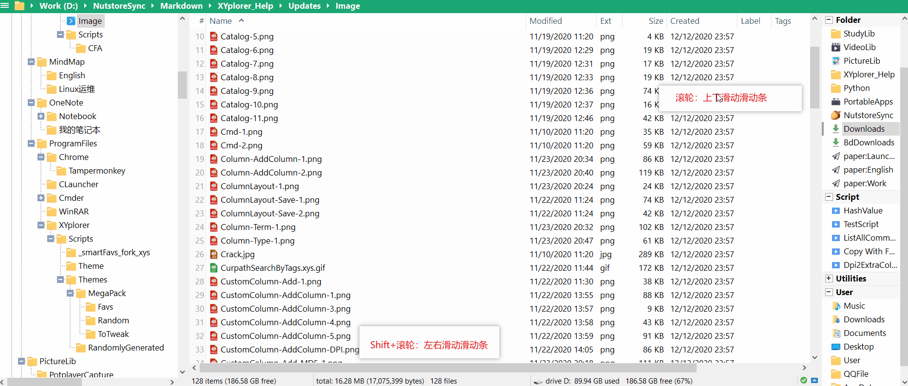

# 1.使用过程中出现崩溃的原因和解决方法

出现崩溃现象效果如下图


会出现一个Coffee的俯视图。

原因就两种，具体看图片红字描述。


减少或避免出现崩溃的方法

* 选中非最后一个标签页，然后新建标签页
* 尽量少用`设置(Configuration(F9))`按钮，如果要用，记得在File -> Save Setting，否则会丢失本次打开的使用记录。


重要提示：上述图中两个原因所述的危险操作执行前，请确保XY的数据已经备份。因为崩溃后，本次会话的XY数据会全丢失。


# 2.批量命名 | Rename Special

## 案例1 寻找指定字符串进行替换

需求背景：保证视频文件名(不含后缀)与外挂字幕文件名(不含后缀)一致，Potplayer播放时就会自动载入字幕，为了完成这样的需求，需要改动网上下载到的字幕文件名。

我现有如下文件:

```
F:\Downloads\[VCB-Studio] Shokugeki no Souma][Ma10p_1080p][x265_flac]Subtitles繁体>dir ./b
[VCB-Studio] Shokugeki no Souma [01][Ma10p_1080p][x265_flac].TC-CASO&SumiSora.ass
[VCB-Studio] Shokugeki no Souma [02][Ma10p_1080p][x265_flac].TC-CASO&SumiSora.ass
[VCB-Studio] Shokugeki no Souma [03][Ma10p_1080p][x265_flac].TC-CASO&SumiSora.ass
[VCB-Studio] Shokugeki no Souma [04][Ma10p_1080p][x265_flac].TC-CASO&SumiSora.ass
[VCB-Studio] Shokugeki no Souma [05][Ma10p_1080p][x265_flac].TC-CASO&SumiSora.ass
[VCB-Studio] Shokugeki no Souma [06][Ma10p_1080p][x265_flac].TC-CASO&SumiSora.ass
[VCB-Studio] Shokugeki no Souma [07][Ma10p_1080p][x265_flac].TC-CASO&SumiSora.ass
[VCB-Studio] Shokugeki no Souma [08][Ma10p_1080p][x265_flac].TC-CASO&SumiSora.ass
[VCB-Studio] Shokugeki no Souma [09][Ma10p_1080p][x265_flac].TC-CASO&SumiSora.ass
[VCB-Studio] Shokugeki no Souma [10][Ma10p_1080p][x265_flac].TC-CASO&SumiSora.ass
[VCB-Studio] Shokugeki no Souma [11][Ma10p_1080p][x265_flac].TC-CASO&SumiSora.ass
[VCB-Studio] Shokugeki no Souma [12][Ma10p_1080p][x265_flac].TC-CASO&SumiSora.ass
[VCB-Studio] Shokugeki no Souma [13][Ma10p_1080p][x265_flac].TC-CASO&SumiSora.ass
[VCB-Studio] Shokugeki no Souma [14][Ma10p_1080p][x265_flac].TC-CASO&SumiSora.ass
[VCB-Studio] Shokugeki no Souma [15][Ma10p_1080p][x265_flac].TC-CASO&SumiSora.ass
[VCB-Studio] Shokugeki no Souma [16][Ma10p_1080p][x265_flac].TC-CASO&SumiSora.ass
[VCB-Studio] Shokugeki no Souma [17][Ma10p_1080p][x265_flac].TC-CASO&SumiSora.ass
[VCB-Studio] Shokugeki no Souma [18][Ma10p_1080p][x265_flac].TC-CASO&SumiSora.ass
[VCB-Studio] Shokugeki no Souma [19][Ma10p_1080p][x265_flac].TC-CASO&SumiSora.ass
[VCB-Studio] Shokugeki no Souma [20][Ma10p_1080p][x265_flac].TC-CASO&SumiSora.ass
[VCB-Studio] Shokugeki no Souma [21][Ma10p_1080p][x265_flac].TC-CASO&SumiSora.ass
[VCB-Studio] Shokugeki no Souma [22][Ma10p_1080p][x265_flac].TC-CASO&SumiSora.ass
[VCB-Studio] Shokugeki no Souma [23][Ma10p_1080p][x265_flac].TC-CASO&SumiSora.ass
[VCB-Studio] Shokugeki no Souma [24][Ma10p_1080p][x265_flac].TC-CASO&SumiSora.ass
```

我的替换要求是:

`[VCB-Studio] Shokugeki no Souma [xx][Ma10p_1080p][x265_flac].TC-CASO&SumiSora.ass`替换为`[VCB-Studio] Shokugeki no Souma [xx][Ma10p_1080p][x265_flac].ass`，即`.TC-CASO&SumiSora`需要替换为`""`(即内容为空白，体现在替换内容中就是什么内容都不输入)。

选中所有相关文件，然后菜单栏`File->Rename Special->Search and Replace...`

具体操作如下:


你还可以预览下结果:


语法格式：

```
before/now		//文件中含有的"before"替换为"now"
```

'/'的作用为:  

> define a string to be replaced by another string, both strings separated by '/'.

## 案例2 替换字符串中某个范围的内容

这个案例讲解正则表达式的运用。

### Example1

Example1: 比如有以下文件，需要把`「`和`」`之间的内容去掉（包括边界「和」），该如何操作

```
问题儿童都来自异世界？ -01 「問題児たちが箱庭にやって来たようですよ？」 BDrip x264-ank.kna.mkv_20201106_184156.071.jpg
问题儿童都来自异世界？ -01 「問題児たちが箱庭にやって来たようですよ？」 BDrip x264-ank.kna.mkv_20201106_184206.959.jpg
问题儿童都来自异世界？ -04 「黒ウサギがエロイヤらしい奴に狙われたようですよ？」 BDrip x264-ank.mkv_20201107_233735.989.jpg
问题儿童都来自异世界？ -04 「黒ウサギがエロイヤらしい奴に狙われたようですよ？」 BDrip x264-ank.mkv_20201107_235627.895.jpg
问题儿童都来自异世界？ -04 「黒ウサギがエロイヤらしい奴に狙われたようですよ？」 BDrip x264-ank.mkv_20201107_235634.839.jpg
问题儿童都来自异世界？ -05 「誓いは星の彼方にだそうですよ？」 BDrip x264-ank.kna.mkv_20201108_164005.740.jpg
问题儿童都来自异世界？ -05 「誓いは星の彼方にだそうですよ？」 BDrip x264-ank.kna.mkv_20201108_220102.628.jpg
问题儿童都来自异世界？ -05 「誓いは星の彼方にだそうですよ？」 BDrip x264-ank.kna.mkv_20201108_220119.796.jpg
问题儿童都来自异世界？ -05 「誓いは星の彼方にだそうですよ？」 BDrip x264-ank.kna.mkv_20201108_220122.821.jpg
问题儿童都来自异世界？ -06 「問題児たちがお祭り騒ぎに参加するようですよ？」 BDrip x264-ank.kna.mkv_20201108_220533.452.jpg
问题儿童都来自异世界？ -06 「問題児たちがお祭り騒ぎに参加するようですよ？」 BDrip x264-ank.kna.mkv_20201108_220540.260.jpg
问题儿童都来自异世界？ -06 「問題児たちがお祭り騒ぎに参加するようですよ？」 BDrip x264-ank.kna.mkv_20201108_220544.739.jpg
问题儿童都来自异世界？ -06 「問題児たちがお祭り騒ぎに参加するようですよ？」 BDrip x264-ank.kna.mkv_20201108_220550.478.jpg
```

需要用到`File->Rename Special->RegExp Rename...`的功能。

两种语法格式如下: 

```
RegExpPattern > ReplaceWith     (case-insensitive: a=A)
RegExpPattern > ReplaceWith\    (case-sensitive)
```

特别注意: <span style="color:red">**`>`前后都需要补一个空格**</span>，否则不管匹配的正则表达式是正确的，也会出错。

正则表达式用于匹配符合规则的字符。匹配的规则就在正则表达式中，那么匹配时，会按正则表达式锁描述规则从头到尾扫描即将要匹配的字符串。

可以先去[正则表达式在线测试 | 菜鸟工具](http://c.runoob.com/front-end/854)测试下匹配结果：


接着，我们进行使用`RegExp Rename...`进行替换:

```
「[\s\S]+」 > 
// \s是匹配所有空白符，包括换行，\S是匹配非空白符，包括换行。
// [\s\S]匹配所有,但只匹配一个满足条件的字符
// +是限定符，用于指定它前面的表达式的匹配次数
// [\s\S]+表示多次匹配所有字符,匹配多个满足条件的字符
//「[\s\S]+」匹配以'「'开头和'」'结尾以及它们之间的所有字符
```


预览结果：


成功完成替换：


在BDrip前面加上-：

```
\s+BDrip > -BDrip
```

结果如下：


替换结束。

### Example2

由于`「`和`」`比较特殊，我们考虑下面这种情况：

Example2: 比如形如以下文件，我想要将`1`和第一个`B`之间的内容（包括边界1和B）替换空串

```
问题儿童都来自异世界？ -061問題児たちがお祭り騒ぎに参加するようですよ？BBDrip x264-ank.kna.mkv_20201108_220550.4781.jpg
问题儿童都来自异世界？ -061問題児たちがお祭り騒ぎに参加するようですよ？BBDrip x264-ank.kna.mkv_20201108_220550.4782.jpg
问题儿童都来自异世界？ -061問題児たちがお祭り騒ぎに参加するようですよ？BBDrip x264-ank.kna.mkv_20201108_220550.4783.jpg
问题儿童都来自异世界？ -061問題児たちがお祭り騒ぎに参加するようですよ？BBDrip x264-ank.kna.mkv_20201108_220550.4784.jpg
问题儿童都来自异世界？ -061問題児たちがお祭り騒ぎに参加するようですよ？BBDrip x264-ank.kna.mkv_20201108_220550.4785.jpg
问题儿童都来自异世界？ -061問題児たちがお祭り騒ぎに参加するようですよ？BBDrip x264-ank.kna.mkv_20201108_220550.4786.jpg
...
```


因此，XY RegExp Rename匹配规则如下

```
1[\s\S]+B(?=B) > 
```

### Example3

Example3: 形如以下的文件，我想要将`[`和第一个`]`之间的内容（包括边界[和]）替换空串:

```
问题儿童都来自异世界？ -06 [問題児たちがお祭り騒ぎに参加するようですよ？]BDrip x264-ank.kna.mkv_20201108_220550.478.jpg
...
```


因此，XY RegExp Rename匹配规则如下

```
\[[\s\S]+\] > 
```

你可以参考[菜单教程的正则表达式](https://www.runoob.com/regexp/regexp-tutorial.html)部分进行学习，并且该网站也提供了[正则表达式在线测试工具](http://c.runoob.com/front-end/854)。

正则表达式重命名(`RegExp Rename...`)是一项很强大的功能，它相较于`Search and Replace...`，有更高的灵活性，可以定制搜索内容的类型和范围，但也提高了使用成本。

此外，XYplorer使用的是`VB5 regex engine`。

> XY uses the VB5 regex engine.[[?](https://www.xyplorer.com/xyfc/viewtopic.php?t=5357)]


# 3.为什么桌面的文件无法拖到XY里(管理员权限问题)

从[Can't drag folder from Widnows Explorer or Everything to XYporer - XYplorer Beta Club](https://www.xyplorer.com/xyfc/viewtopic.php?p=169149#p169149)帖子中得知由于XYplorer.exe提升到管理员权限后是无法将桌面文件拖到XY中。由此解决方法就是取消"管理员权限运行"。

具体步骤就是


# 4.多个Column的文件列表浏览建议

直接上GIF



从GIF中可以看到当Column变多了，通过加入Shift可以让左右滑动变得更快捷。

# 5.右键新建文件

在XY地址栏输入进入"新建项目"的目录

```
<xydata>/NewItems
```

在cmd中使用Windows的dir命令查询当前目录的文件

```
D:\PortableApps\XYplorer\Data\NewItems>dir /b
Makefile
New Batch File.bat
New Batch File.cmd
New C Header.h
New C.c
New Configuration.ini
New Cpp.cpp
New folder
New Markdown.md
New Microsoft Excel Worksheet.xlsx
New Microsoft Word Document.docx
New Mindjet MindManager Document-兼容2019版.mmap
New MindManager Document-2020版.mmap
New Rich Text Document.rtf
New Text Document.txt
New XYplorer Script.xys
New.html
```

以上输出结果都是文件，这些文件都是用于右键菜单"New Items"：


这些文件跟Windows邮件菜单的新建还不一样，因为存放在"\<xydata\>/NewItems"中的文件都是模板文件，这意味这你可以按照你的需求进行定制。我举个例子吧：

New C.c模板文件中我写入以下内容：

```
#include <stdio.h>

int main() {
    
    return 0;
}
```

以后我右键创建.c文件里面的内容都是按照这个模板文件来的。