说到XY备份和还原问题，我们先得了解下XY的文件夹结构 (该部分费时费力，但可以了解你经常使用功能的对应数据文件的作用)，这样你就知道该备份和还原什

么类型的数据。当然，你也可跳到[备份数据](#backup)进行阅读。

# 文件夹结构
查看文件夹结构介绍[可跳过]

以下给出的是Portable版 (便携版) 的目录结构，

```
D:\PortableApps\XYplorer\Data>DIR
 Volume in drive D is Work
 Volume Serial Number is 2CC0-7192

 Directory of D:\PortableApps\XYplorer\Data

11/05/2020  16:48    <DIR>          .
11/05/2020  16:48    <DIR>          ..
11/05/2020  16:35           146,086 action.dat
11/05/2020  16:31    <DIR>          AutoBackup
11/05/2020  16:31    <DIR>          Catalogs
04/10/2019  10:28           858,784 ChineseSimplified.lng
11/05/2020  16:20    <DIR>          FindTemplates
11/05/2020  16:35             2,758 fvs.dat
11/05/2020  16:31    <DIR>          Icons
11/05/2020  16:35             8,224 ks.dat
11/05/2020  16:31                26 Language.ini
11/05/2020  16:35                18 lastini.dat
11/05/2020  16:31    <DIR>          NewItems
11/05/2020  16:31    <DIR>          Panes
11/05/2020  16:31    <DIR>          Paper
11/05/2020  16:31    <DIR>          Scripts
11/05/2020  16:35               980 tag.dat
11/05/2020  16:20    <DIR>          Temp
11/05/2020  16:35               552 udc.dat
11/05/2020  16:35           129,166 XYplorer.ini
               9 File(s)      1,146,594 bytes
              11 Dir(s)  271,924,928,512 bytes free
```

XYplorer/Data目录下文件信息介绍：

| 文件名                | 简记               | 文件作用                                                     |
| --------------------- | ------------------ | ------------------------------------------------------------ |
| action.dat            | 撤销重做文件       | 撤销或重做历史记录                                           |
| ChineseSimplified.lng | 中文语言文件       | 中文语言文件                                                 |
| fvs.dat               | 文件夹视图文件     | fvs: folder view settings.  保存文件夹视图设置信息           |
| ks.dat                | 快捷键文件         | ks: keyboard shortcuts. 保存键盘快捷键设置信息               |
| Language.ini          | 记录XY使用哪种语言 | XYplorer读取并根据该配置文件信息决定选择使用哪个语言作为界面交互语言。 |
| lastini.dat           | 记录XY使用哪个配置 | 如果存在,则该.dat用于决定让XYplorer载入哪个.ini信息，该.dat保存的值为XYplorer,那么XYplorer就会载入XYplorer.ini |
| tag.dat               | 标签数据           | 保存标注(tags)信息,这个标注信息应该包括标签(Label),注释(Comment),标签(tag)信息。 |
| udc.dat               | 用户自定义命令数据 | udc: user-defined commands. 保存用户自定义命令信息           |
| XYplorer.ini          | XY默认的配置文件   | 保存配置信息，该配置文件不可随意覆盖，XYplorer会调用它，如果随便覆盖它可能会出现版本使用到期。 |

XYplorer/Data目录下文件夹信息介绍：

| 目录名        | 简记                 | 目录作用                                                     |
| ------------- | -------------------- | ------------------------------------------------------------ |
| AutoBackup    | 自动备份目录         | 开启自动备份设置后，里面会保存catalog，fvs，tag，udc的dat文件，但不保存ks.dat，还会保存XYplorer.ini。该文件这些数据信息文件会在触发"Saving Settings"进行更新。该目录的文件可迁移到全新的XYplorer时，记得把ks.dat也复制到新的XYplore/Data下 |
| Catalogs      | 目录侧栏             | 存放目录侧栏信息。默认的目录侧栏信息文件名为catalog.dat      |
| FindTemplates | 搜索模板             | 存放搜索模板                                                 |
| Icons         | 用户图标             | \<xyicons\>表示的目录就是此目录，用户可以把图标文件存放在这里 |
| NewItems      | 右键新建项目         | XYplorer空白处右键New->New Item的内容                        |
| Paper         | 纸文件夹             | 存放纸文件夹，保存的文件以.txt形式保存                       |
| Scripts       | 用户脚本             | \<xyscripts\>所指向的目录就是此目录。用户写的Script可以放在这里 |
| Panes         | 两个窗格的标签页集合 | XY有两个窗格，每个窗格的标签页集合信息可以存放此处           |
| Temp          | 临时文件             | 存放XYplorer运行时会用到的临时文件                           |
| Thumbnails    | 文件缩略图           | 存放缩略图缓存                                               |

XYplorer Beta Club论坛关于[文件夹结构的英文描述](https://www.xyplorer.com/xyfc/viewtopic.php?t=15133)

```
Catalogs        catalogs
FindTemplates   search templates (saved searches)
Fresh           skip this, this is a temporary profile
Icons           icons default path
NewItems        new items menu items (Menu > Edit > New Items)
Panes           tabsets
Paper           paperfolders default save location
Scripts         scripts default path
Thumbnails      thumbnails cache default location
action.dat      undo/redo history
fvs.dat         folder view settings
ks.dat          keyboard shortcuts
pv.dat          permanent variables (for scripting)
tag.dat         tags, labels, comments
udc.dat         User-defined commands (Menu > User)
XYplorer.ini    main settings file (lastini.dat, if it exists, decides which ini file name is loaded)
```

`language.ini`：Without "Language.ini" the app will load with the embedded English strings just as all the time before multilingual support. [^1]

`Temp`：Store temporary files used by XYplorer, instead of using %TEMP% (C:\Users\[username]\AppData\Local\Temp).[^2]

在进行迁移或备份用户数据时，保存Data文件夹即可。

如果你的配置文件不是以`XYplorer.ini`名为的，你还需要保存`lastini.ini`文件。

# <span id="backup">备份数据</span>

❗备份**Data文件夹**。迁移时直接粘贴备份的Data文件夹到新的XY目录下即可。

强调一遍：使用了标签的同学们，一定要保存好tag.dat，里面装了你保存的标签信息，切记。

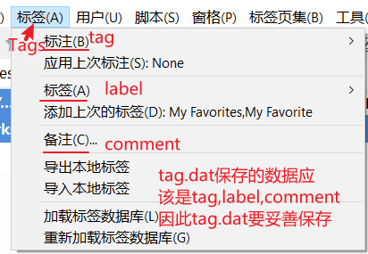


# 单项用户数据保存和载入

根据你自己的喜欢，重命名数据文件。

## XYplorer配置文件

XYplorer配置文件保存：

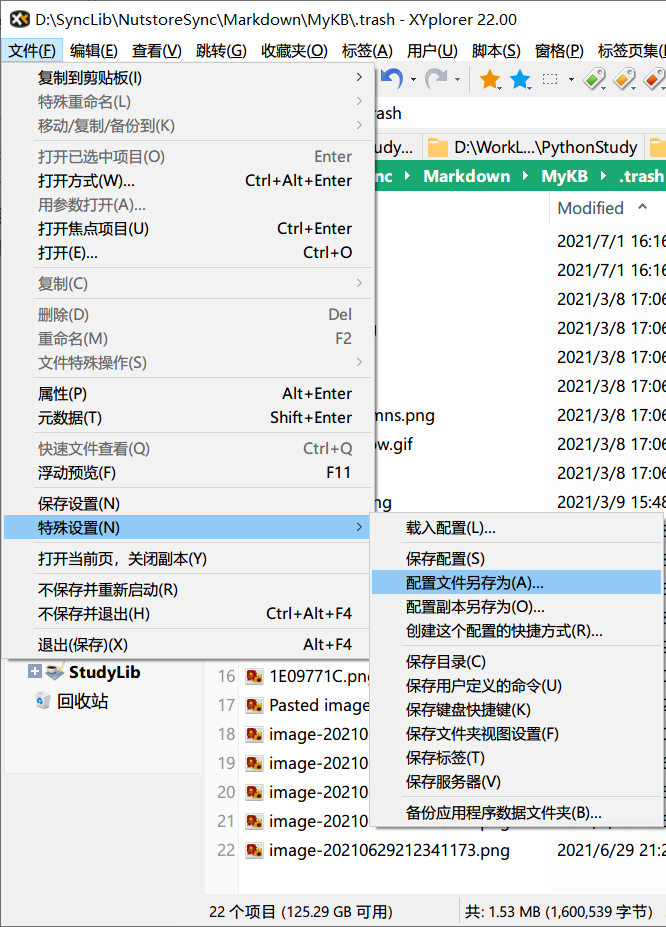

快捷键为依次按下<kbd>ALT</kbd>，<kbd>N</kbd>，<kbd>N</kbd>，<kbd>方向键→</kbd>，<kbd>A</kbd>。保存为其他名称，比如MyConfig.ini。

加载XYplorer配置文件：

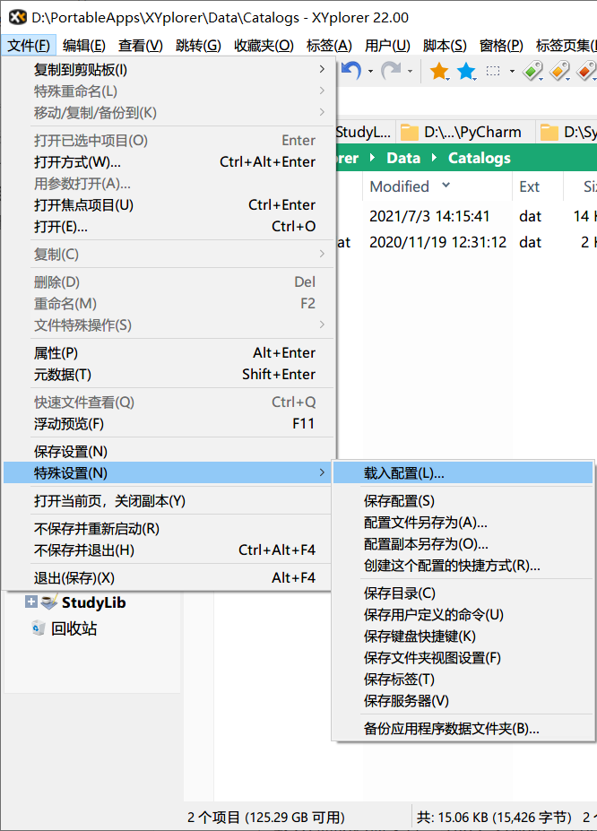

快捷键为依次按下<kbd>ALT</kbd>，<kbd>N</kbd>，<kbd>N</kbd>，<kbd>方向键→</kbd>，<kbd>L</kbd>。

例如，选择MyConfig.ini，这时候应该会新生成一个lastini.dat文件，该文件的值为MyConfig，意思是当前XYplorer指向了MyConfig.ini配置文件。

## 标签集

标签集保存：

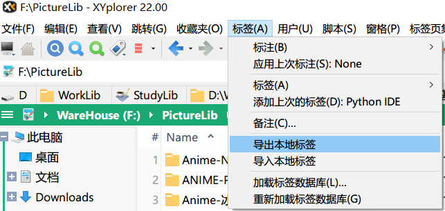

载入Tags信息有两种方法：

一种方法是


默认加载的是`<xydata>\tag.dat`，如果你有保存其他名称的标签数据，可以填写对应路径使用它。

另一种是

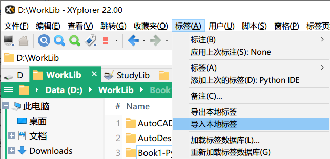

删除Tags的全部信息：

❗❗❗危险操作

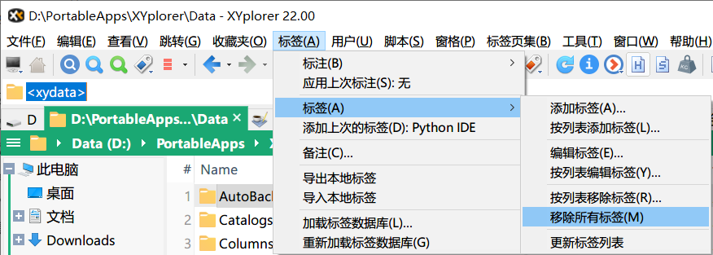

或者

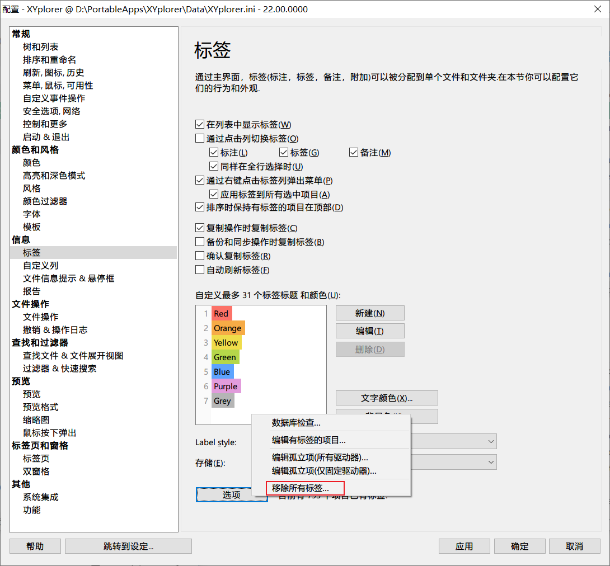

快捷键F9进入设置，信息 - 标签 - 选项 - 移除所有标签。

## 目录侧边栏

按下<kbd>F8</kbd>打开导航面板，再按下<kbd>CTRL</kbd> + <kbd>F8</kbd>打开目录侧边栏。

目录侧边栏保存：

在目录侧边栏的空白处，或者标黑体的目录名称处右键


上图红框中，“保存”表示当前目录侧边栏信息保存在`<xycatalogs>\catalog.dat`中；“另存为”表示当前目录侧边栏信息保存用户指定的新文件，并且XY使用这个新文件；“副本另存为”表示XY将当前目录侧边栏信息保存到用户指定的新文件，但XY依然使用位于`<xycatalogs>\catalog.dat`的目录侧边栏信息。

目录侧边栏加载：

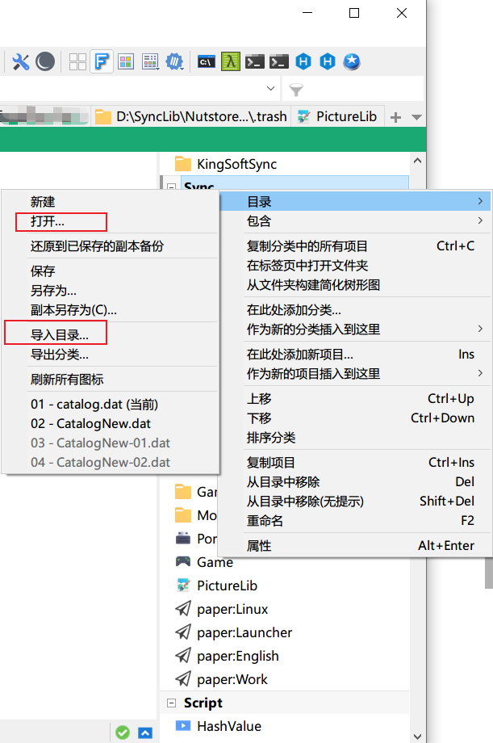

“打开”需要选择目录侧边栏信息文件，以此载入目录侧边栏。

“导入目录”表示将选定的目录侧边栏信息文件导入到当前目录侧边栏中。

## 布局

布局（Layout）：是否显示地址栏，工具栏，标签页栏，状态栏，树，目录，文件列表等等，以及它们的位置摆放信息。

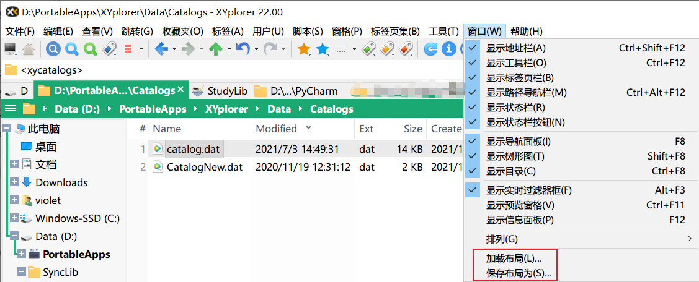

加载和保存布局功能位于：菜单栏 - 窗口 - 加载布局，或保存布局为。

## 窗口

XY支持双窗格(Panel)，通过F10切换到单/双窗格，第一个窗格为Tabset 1，第二个窗格为Tabset 2。

Tabset用于保存某个窗格的所有标签页信息。

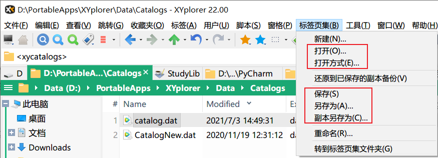

## 用户自定义命令

用户自定义命令位于udc.dat，妥善保存。

## 用户快捷键

用户快捷键位于ks.dat，妥善保存。

# 还原 (迁移)

备份数据文件只是为了防止哪天XY误删了，才需要还原。如果你是为了升级到最新版，你可以直接尝试在线升级到最新版。

如果升级失败，出现许可证到期的问题，可以去网上下载别人破解的最新版，然后将Data目录覆盖到新版本XY中，但覆盖时不能覆盖同名的XYplorer.ini文件。

下面讲解迁移思路：

准备一个全新版本XYplorer，然后把旧版本的Data覆盖到新的XYplorer/Data

迁移旧XY的数据目录到新XY，需要遵循以下步骤：

1. 将旧XY的Data目录复制一份到桌面

2. 对Desktop/Data/XYplorer.ini进行重命名，可以命名为`MyXYConfig.ini`

3. 将桌面旧XY的Data目录覆盖到新XY/Data目录

4. 打开新XY，在新XY菜单栏`File->Settings Special->Load Configuration...`，通过载入配置选项来载入MyXYConfig.ini。

   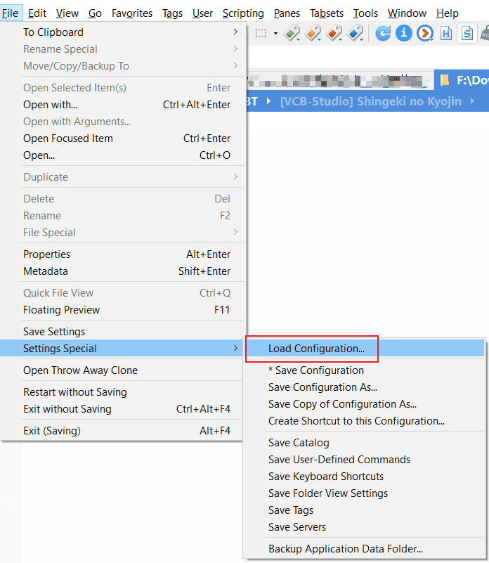

解释下为什么要这样做

如果直接将旧XY/Data/XYplorer.ini对新XY/Data/XYplorer.ini覆盖，可能会发生打开新XY出现许可证失效提示。不但如此，实际上，旧XY的数据也没有

载入成功到新XY。

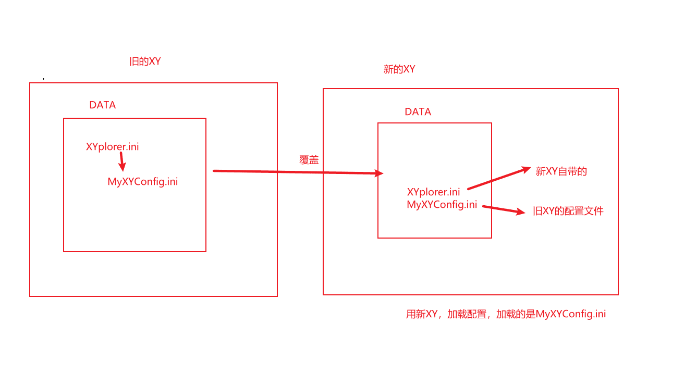

[^1]: [XYplorer Translation Guide](https://www.xyplorer.com/xyfc/viewtopic.php?t=8809)
[^2]:  [What is the purpose of the Temp folder in application data folder - XYplorer Beta Club](https://www.xyplorer.com/xyfc/viewtopic.php?t=19821)

