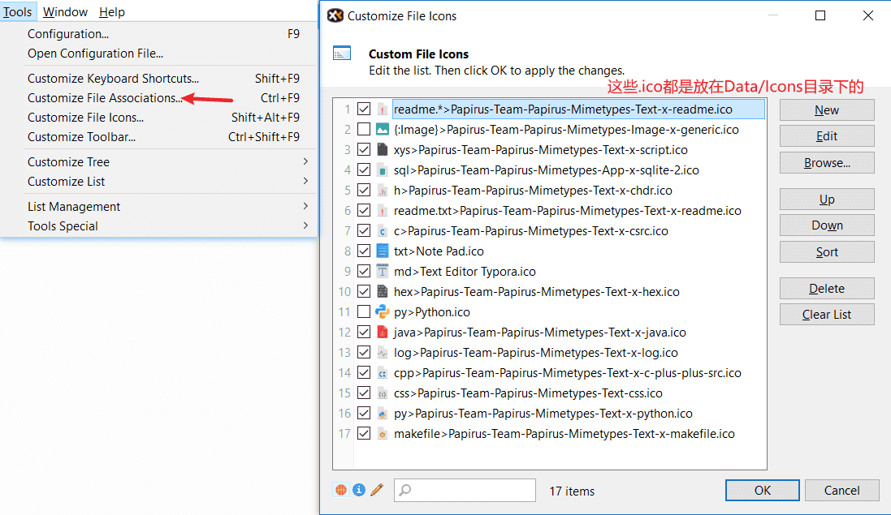
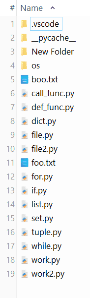
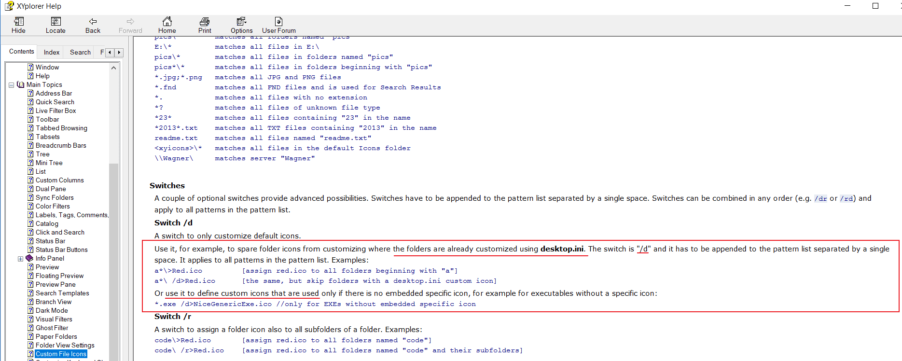
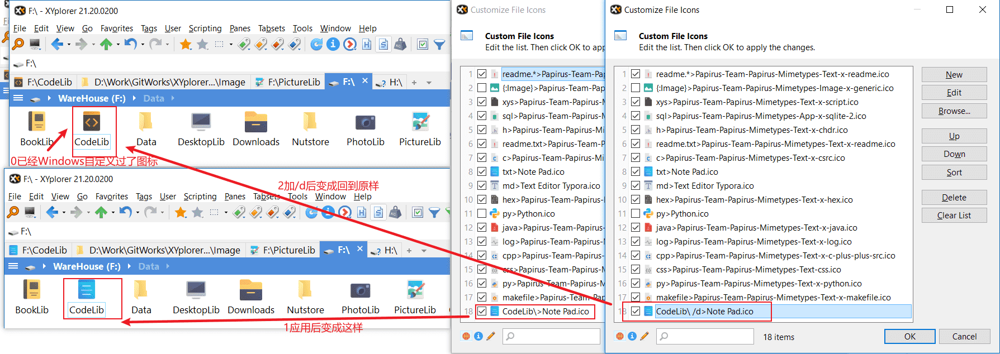

返回:   

# 自定义文件夹图标(CFI)

## CFI配置方法



File Icons的配置在`XYplorer.ini`中：以下内容就摘自此文件

```ini
[FileIcons]
Count=17
1=+readme.*>Papirus-Team-Papirus-Mimetypes-Text-x-readme.ico
2={:Image}>Papirus-Team-Papirus-Mimetypes-Image-x-generic.ico
3=+xys>Papirus-Team-Papirus-Mimetypes-Text-x-script.ico
4=+sql>Papirus-Team-Papirus-Mimetypes-App-x-sqlite-2.ico
5=+h>Papirus-Team-Papirus-Mimetypes-Text-x-chdr.ico
6=+readme.txt>Papirus-Team-Papirus-Mimetypes-Text-x-readme.ico
7=+c>Papirus-Team-Papirus-Mimetypes-Text-x-csrc.ico
8=+txt>Note Pad.ico
9=+md>Text Editor Typora.ico
10=+hex>Papirus-Team-Papirus-Mimetypes-Text-x-hex.ico
11=py>Python.ico
12=+java>Papirus-Team-Papirus-Mimetypes-Text-x-java.ico
13=+log>Papirus-Team-Papirus-Mimetypes-Text-x-log.ico
14=+cpp>Papirus-Team-Papirus-Mimetypes-Text-x-c-plus-plus-src.ico
15=+css>Papirus-Team-Papirus-Mimetypes-Text-css.ico
16=+py>Papirus-Team-Papirus-Mimetypes-Text-x-python.ico
17=+makefile>Papirus-Team-Papirus-Mimetypes-Text-x-makefile.ico
```

效果大概就是这样子的：



## CFI语法

使用CFI定义可以对符合匹配规则的文件进行图标替换。

### 参考

更多参考CFI，请在XY地址栏输入：

```
rtfm "idh_cfi.htm";
```

### 定义

CFI定义如下：

```x
"Caption" Pattern(s)>Icon Source
```

`"Caption"`[可选]:个人注释

`Pattern(s)`[必须]:匹配规则

`Icon Source`[必须]:图标目录。

比如，

```
txt;ini;xml>xxx.ico //图标位于<xyicons>/xxx.ico。匹配文件格式是.txt, .ini, .xml
```

### 注释

除了可以用双引号括起来并放置到最前面作为个人注释，还可以使用`//`。

`//`：注释符。当匹配项目被执行时，注释符前面的空格都会被剔除。

```
*.txt>Houellebecq.ico //comment
```

### 用例

从帮助文档(F1)摘出来的：

```
%computer%    matches the Computer special folder
%desktop%     matches the Desktop special folder
%personal%    matches the Personal special folder
%user%        matches the User special folder
%net%         matches the Network special folder
%recycler%    matches the Recycle Bin special folder
E:\           matches drive E:\
E:\*\         matches all folders in E:\
E:\ /r        matches all folders in E:\ and E: itself
E:\Jobs\*\    matches all folders in E:\Jobs\
[F-L]:\*\     matches all folders on drives F-L
*\            matches all folders that have no specific icon
**\           same as above for the current tree folder
pics\         matches all folders named "pics"
E:\*          matches all files in E:\
pics\*        matches all files in folders named "pics"
pics*\*       matches all files in folders beginning with "pics"
*.jpg;*.png   matches all JPG and PNG files
*.fnd         matches all FND files and is used for Search Results
*.            matches all files with no extension 
*?            matches all files of unknown file type
*23*          matches all files containing "23" in the name
*2013*.txt    matches all TXT files containing "2013" in the name
readme.txt    matches all files named "readme.txt"
<xyicons>\*   matches all files in the default Icons folder
\\Wagner\     matches server "Wagner"
```


## 如何让CFI不覆盖Windows自定义图标

问：我的文件夹都已经自定义图标了，这个`File Icons`设置的图标会不会覆盖Window设置的图标呢？

答：符合条件的File Icons会替换Windows设置的图标的。不过可以加下参数保留Windows设置的图标。

在帮助文档中已经给出了答案：





## 图标资源

如何找到Icon资源呢？

| Caption          | Site                                                      |
| ---------------- | --------------------------------------------------------- |
| Icon Archive     | https://iconarchive.com/                                  |
| 我自己收集的到的 | https://pan.baidu.com/s/1q39yFrAQF1v8jTlzPba_fg<br />zdif |

