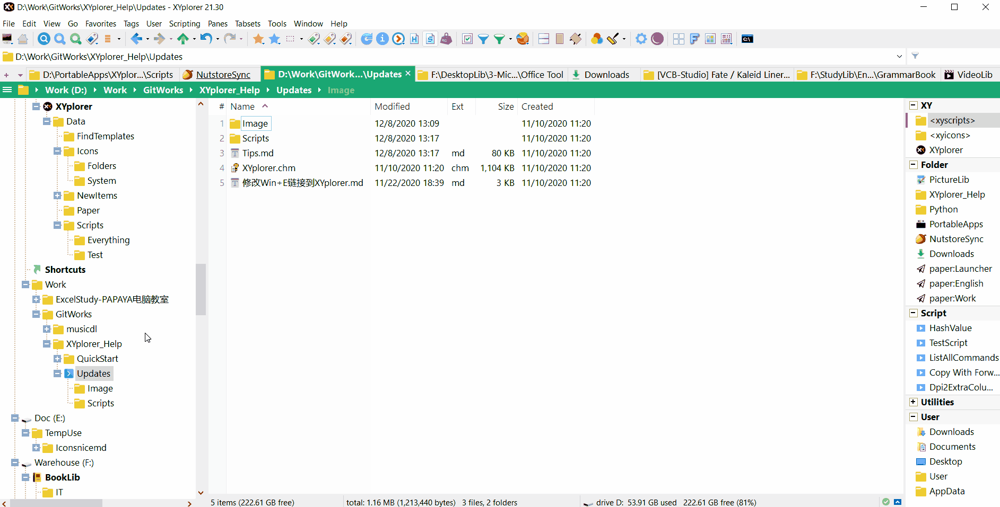
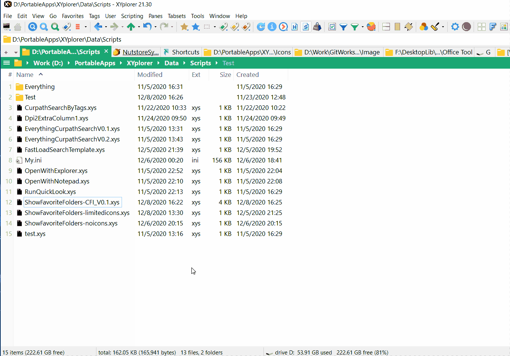
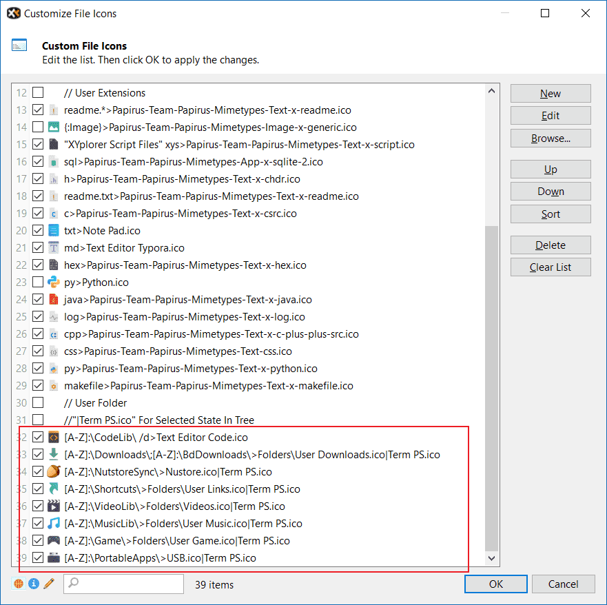

# 树面板右键弹出收藏文件夹列表

我们都知道在开启树的左侧栏后，在其空白处右键可以打开收藏文件夹列表，示意图如下：



但如果我们把树左侧栏关闭后，这个快速打开收藏文件夹列表的功能就用不了了。为了快速打开收藏文件夹列表，我写了脚本专门用于设置快捷键后，从鼠标出呼出收藏文件夹列表。

# 文件列表视窗呼出收藏文件夹列表

以下脚本文件通过设置快捷键后可以达到“使用快捷键在鼠标所在位置呼出收藏文件夹列表”的效果：

显示无图标版收藏文件夹列表的脚本(ShowFavoriteFolders-noicons.xys)：

```
	$fav_folders = favs('d');
	// If $fav_folders is "", then terminate the running script, and else nothing be done.
	end $fav_folders == "";
	$fav_folders_list =;
	foreach($token, $fav_folders, "<crlf>") {
		$fav_folders_list .= '|'.$token;
	}
	$selected = popupmenu($fav_folders_list);
	end $selected == "";
	goto $selected;
```

显示有限图标的收藏文件夹列表的脚本(ShowFavoriteFolders-limitedicons.xys)：

```
	$fav_folders = favs('d');
	// If $fav_folders is "", then terminate the running script, and else nothing be done.
	end $fav_folders == "";
	$fav_folders_list =;
	foreach($token, $fav_folders, "<crlf>") {
		// sep_item: "Caption;Data;Icon;State"
		// is paper?
		if(regexmatches($token, "^paper:") == "paper:") {
			$token = $token.';;:paper';
		}// is folder but not paper folder
		elseif(exists($token) == 2) {
			//Please substitute the generic folder icon you want for "Folders\Folder Yellow.ico"
			$token = $token.";;Folders\Folder Yellow.ico";
		}
		$fav_folders_list .= '|'.$token;
	}
	$selected = popupmenu($fav_folders_list);
	end $selected == "";
	goto $selected;
```

脚本说明：<code>$token = $token.";;Folders\Folder Yellow.ico";</code>换成你想要的图标位置，不加绝对路径，默认位置为\<xyicons\>。比如，脚本中这部分替换为<code>$token = $token.";;你想要的图标.ico";</code>，那么会从XY的"Data\Icons"目录下寻找；或者这部分替换为<code>$token = $token.";;G:\你想要的图标.ico";</code>，那么会寻找"G:\你想要的图标.ico"。

"ShowFavoriteFolders-limitedicons.xys"效果演示：(我设置的快捷键是<kbd>Shift+F</kbd>，关于如何设置脚本与快捷键关联请参考[XYplorer-用户自定义命令篇(UDC)](./XYplorer-用户自定义命令篇(UDC).md))


在打开收藏文件夹列表是否能根据Customize File Icons(CFI)信息动态获取自定义的图标么？

如果想要根据文件名和文件的扩展名获取来自Customize File Icons(CFI)的图标，在Scripting Commands中并没有类似getIcons()这样的函数，那么想要获取CFI图标信息，需要读取XY使用的配置文件。比如XY使用的配置文件是XYplorer.ini，那么CFI图标信息在配置文件的`[FileIcons]`中，可以通过文本编辑器自带的搜索功能搜索此关键词组。

显示CFI图标的收藏文件夹列表的脚本(ShowFavoriteFolders-CFI_V0.1.xys)：(该脚本只适用CFI信息不为空时才可打开收藏文件夹列表)

```
	// 该脚本只适用CFI信息不为空时才可打开收藏文件夹列表
	// XY配置文件路径
	$ini = "<xydata>\XYplorer.ini";
	$section_count = getkey("Count", "FileIcons", $ini);
	$iterator = 1;
	$value_list = ;
	while($iterator <= $section_count) {
		$value_list .= getkey($iterator, "FileIcons", $ini)."<crlf>";
		$iterator++;
	}
	if($value_list != "") {
		// extract folder info for CFI
		//echo $value_list;
		$cfi_list = ;
		// 读取CFI信息到$cfi_list
		foreach($token, $value_list, "<crlf>") {
			if(regexmatches($token, "\\>") != "") {
				$cfi_list .= $token."<crlf>";
			}
		}
	}
	
	// 该函数支持匹配形如“[A-Z]:\Shortcuts\>Folders\User Links.ico|Term PS.ico”这样的CFI项目
	// 该函数不适合纸文件夹的图标匹配
	// @src: 收藏文件夹名(该字符串最末尾以'\'结尾)
	// @cfi_list: 从.ini扫描到的CFI项目
	// @return: src若与CFI其中一项匹配上,返回加上CFI图标路径的sep_item,否则返回Generic folder图标
	function match_cfi($src, $cfi_list) {
		// Fav folder e.g D:\Shortcuts\ 取出字符串最后面的'\'
		$src_temp = substr($src, 0, -1);
		foreach($token, $cfi_list, "<crlf>") { 
			// [可选编程]先过滤掉一些规则
			// token_pre="Selected State of Folder In Tree" **\
			// "**\"
			//echo regexmatches($token, "\*\*\\");
			
		
			// CFI项目不包括图标路径的部分进行修改：将'\'改成"\\",并且去掉开头的'+'。这是前缀用于匹配
			$token_pre = replace(substr($token, 1, strpos($token, ">")-2), "\", "\\");
			
			// Regex pattern 可能包含'*','?',需要进行转换为正确的pattern
			$token_pre = replace($token_pre, "*", "\*");
			$token_pre = replace($token_pre, "?", "[A-Z]");
			
			// CFI项目获得图标部分
			$token_post = substr($token, strpos($token, ">")+1, strlen($token));
			//echo "token_pre=".$token_pre."<crlf>"."token_post=".$token_post."<crlf>";
			//echo "src=".$src."<crlf>"."src_temp=".$src_temp."<crlf>";
			
			// Match specified folder
			if(regexmatches($src_temp, $token_pre) == $src_temp) {
				$src = $src.";;".substr($token_post, 0, strpos($token_post, "|"));
				return $src;
			}
		}
		// 没有匹配到CFI就返回一般性文件图标的sep_item
		return $src.";;Folders\Folder Yellow.ico";
	}

	// CFI信息为空
	if($cfi_list != "") {
		$fav_folders = favs('d');
		// If $fav_folders is "", then terminate the running script, and else nothing be done.
		end $fav_folders == "";
		$fav_folders_list =;
		foreach($token, $fav_folders, "<crlf>") {
			// sep_item: "Caption;Data;Icon;State"
			// is paper?
			if(regexmatches($token, "^paper:") == "paper:") {
				$token = $token.';;:paper';
			}// is folder but not paper folder
			elseif(exists($token) == 2) {
				$token = match_cfi($token, $cfi_list);
			}
			$fav_folders_list .= '|'.$token;
		}
	}
	$selected = popupmenu($fav_folders_list);
	end $selected == "";
	goto $selected;
```

使用演示：



这个脚本目前如图所示这样的规则：



当然你也可以设置为"[A-Z]:\A\B>xxx.ico"这样的多级目录试一试。

这个脚本比上面两个脚本执行速度要慢得多。

