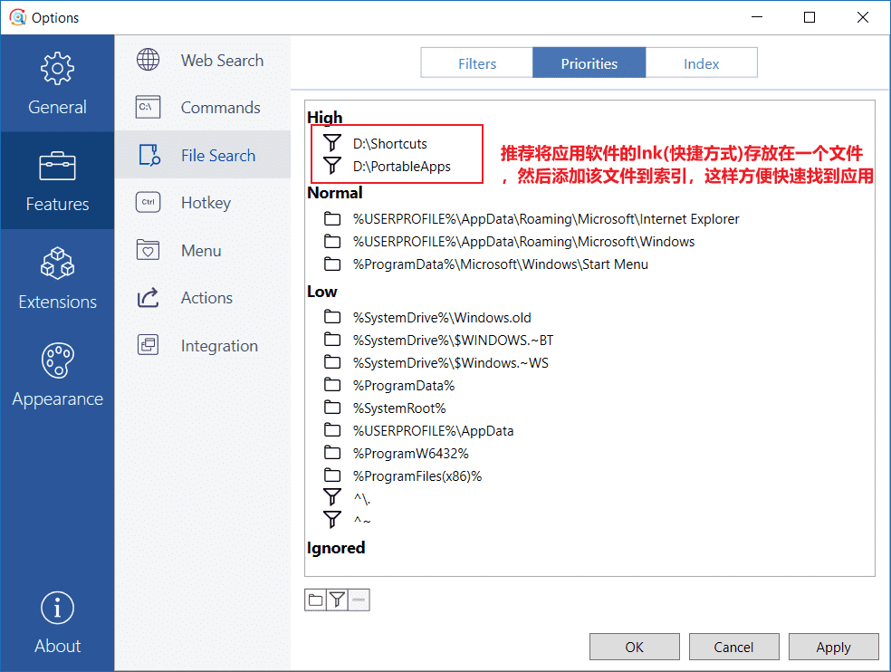
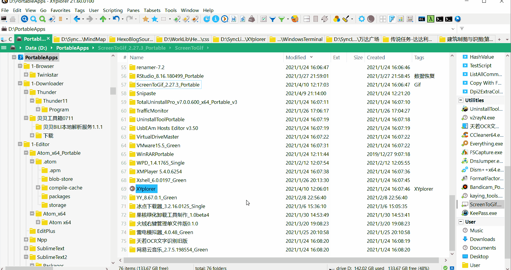
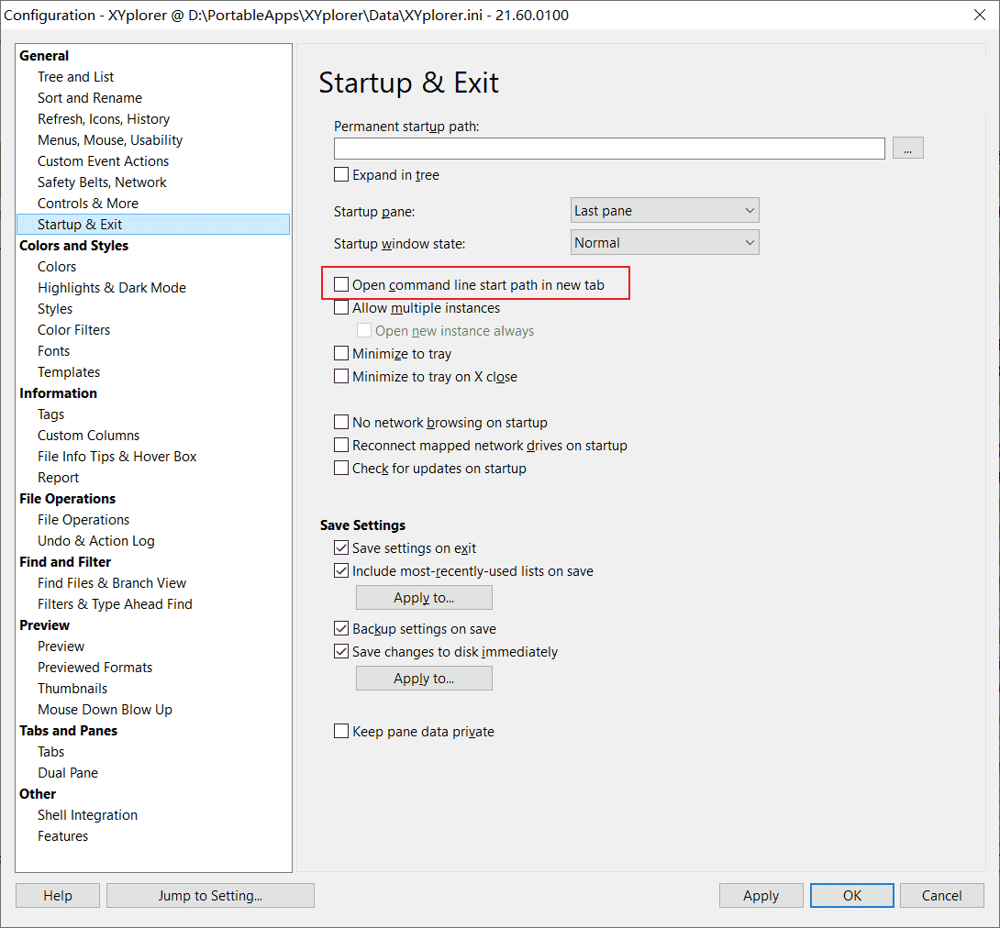
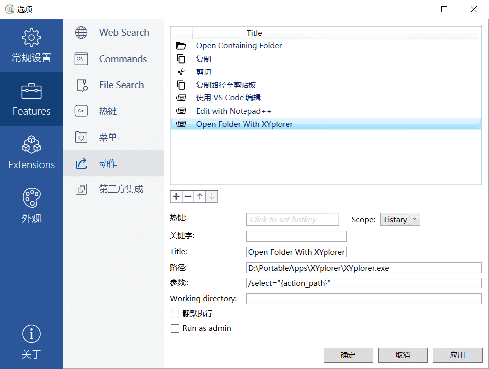

# XYplorer最佳配套

XYplorer + Listary + Everything，这个组合我用了很多。

Everything以弥补XYplorer搜索的短板，但想要搜索XY中的标签（Tags）就需要使用XY

# Listary集成XYplorer

## 无法有效集成的解决方法

为了保证Listary能集成到XY，请下载[Listary6](https://www.listary.com/download)。

使用Listary5 Pro，有时不能集成到XY，而且对话框不能有效的基于XY当前目录进行切换。如果你还是要使用Listary5，我建议你将Listary按照非系统盘或者系统盘的两个Program Files文件夹以外且由你新创建的文件夹，比如C:\Listary。然后设置为管理员模式运行。

如果还是不能集成到XY，我建议你使用Listary6。

还有一种方法我还没试过：取消XY以管理器权限运行，然后Listary以管理员权限运行。大家可以尝试下。

## 目录快速切换

Listary与XY搭配中，最棒的功能是：所有弹出的对话框可以基于XY当前目录进行快速切换。

## 添加快捷方式文件夹到索引

同时，Listary可以用于快速启动应用软件。为了快速检索应用软件，建议按图要求进行操作：



以上是Listary6的设置方法，Listary5也是一样的设置方法。

## 在XY中对当前目录匹配时Listary Popup Menu(Listary弹出窗口)并不是最佳选择

<kbd>Ctrl + Alt + X</kbd>进入Live Filter Box输入，搜索关键字，即可筛选当前目录的文件。这部分可以参考  的Live Filter Box部分。

当然Popup Menu还有收藏夹，还有快速匹配关键字的结果，这个结果优先是当前目录，然后是其他目录。正是因为结果集列出除当前目录以外的结果，因此才建议使用XY的Live Filter Box功能。

## 在Listary中使用XY打开并焦点到目标文件

通过设置达到在Listary搜索列表中选中目标文件 -> XY打开目标文件夹并焦点到目标文件。具体效果如下：




Listary选中的目标文件焦点到XY的设置方法：

打开XY设置，具体设置如图所示



如果"Open command line start path in new tab"勾选上，Listary选中的目标文件利用XY打开时，会出现在XY新的标签页打开。

打开Listary设置，具体设置如图所示：



路径填写XY的路径。


Listary动作功能中参数一栏填写的"/select"由XY提供，具体参考Command Line Switches。

```
rtfm "idh_commandlineswitches.htm";	// 在XY地址栏输入此条命令进行参考
```

"{action_path}"为Listary action可用参数，其值为目标文件的路径。


# Everything与XYplorer的联动

这部分可以参考XYplorer-Search.md。

