# 使用经历

期待Windows文件管理器支持多标签，听说Windows10要推出多标签文件管理器，直到现在也没有出多标签的文件管理器。

Clover功能太少，而且有时会卡死。

Q-Dir虽然小巧，但没XYploer全面。


# XYplorer介绍

支持多标签页，浏览文件管理时就跟使用Chrome之类的浏览器感觉一般，从浏览方便性，和切换滑顺程度，真的比原本Windows10的Explorer文件管理器要得多。可以从大部分程度上替代原生文件管理器。


## 主界面介绍

术语科普


## 双窗格(Dual Pane)-单窗格切换

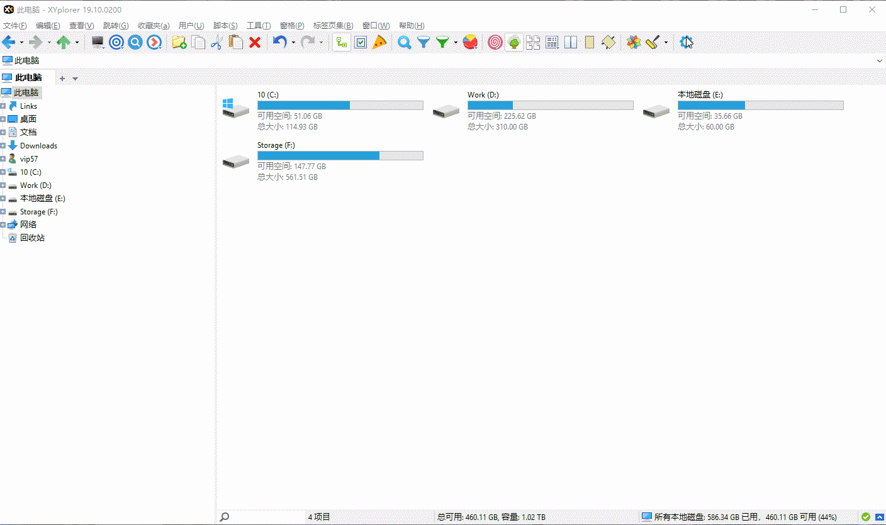


## 多个标签栏(New Tab)快捷打开&关闭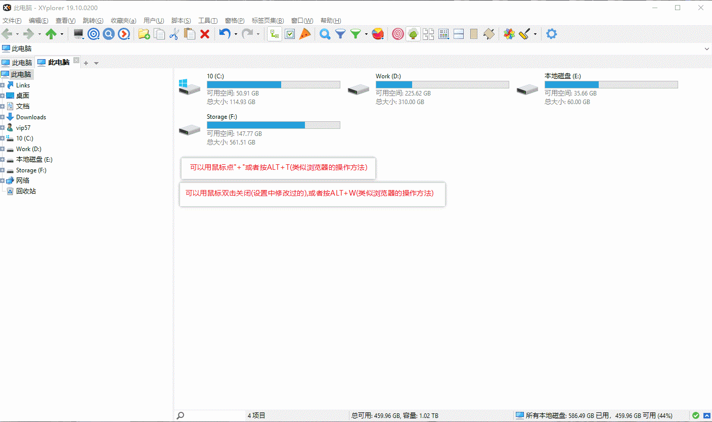

鼠标双击关闭录制GIF忘了录进去，到时候修改配置后你们也可以自己尝试


## 快速预览(Hover Box)

ALT按住，同时鼠标移动到图片上就行了（活动窗口下使用）

方法一

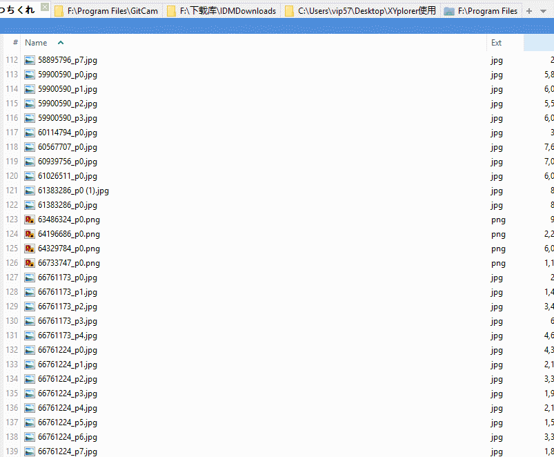


方法二

F9->进入配置->显示悬停框->应用到...->需要预览的文件格式

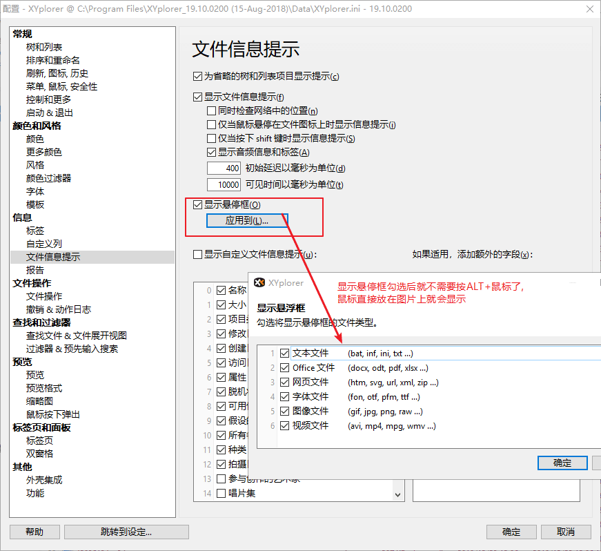

设置后也可以达到快速预览的效果

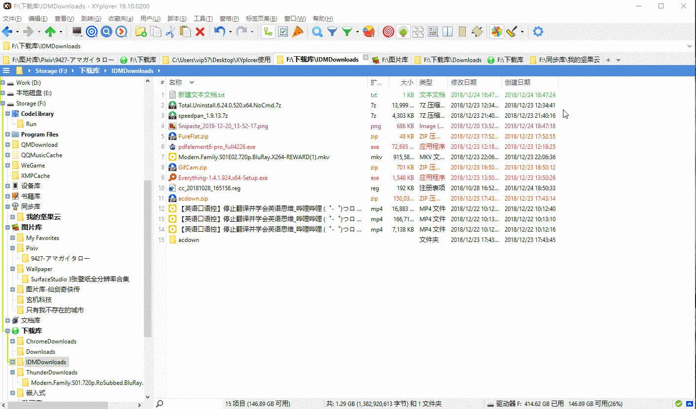


注: 有些视频格式并不能预览


注: 什么是活动窗口 (Active Window) ？

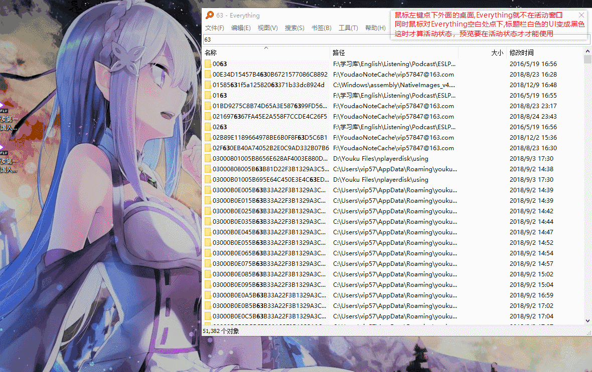


## 方便的鼠标快捷(快捷返回后上一级路径)
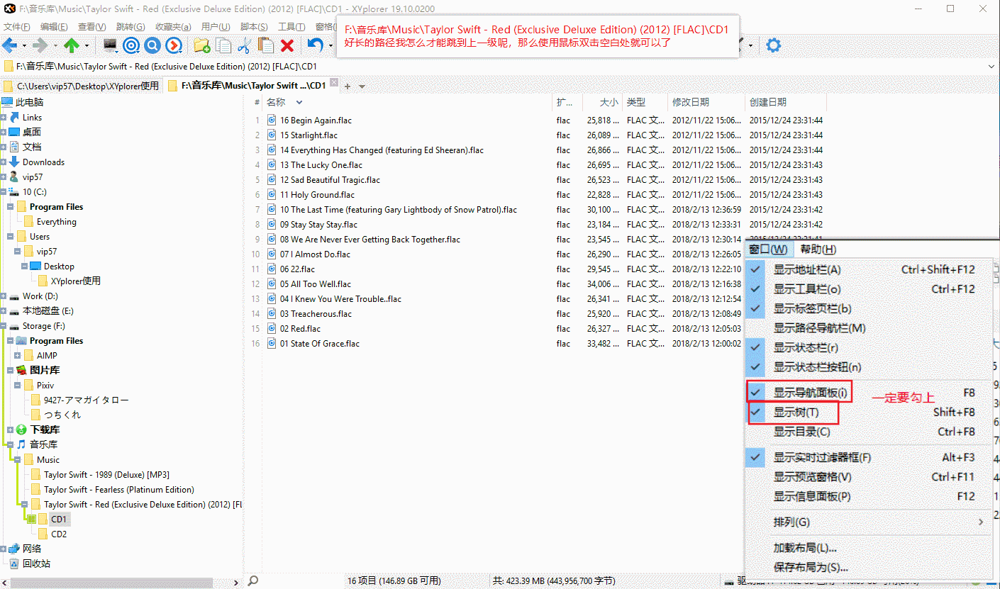

不知道你感受到在GIF中，XYplorer切换起来的顺滑感觉没？


## 路径及历史路径追踪(Tree)

比如，我进入这个路径：F:\音乐库\Music\Taylor Swift - Red (Exclusive Deluxe Edition) (2012) [FLAC]\CD1时，注意到左边的树Tree绿色跟踪了没？就是这种跟踪。有什么好处呢？当你想再次进入以前进入过的CD1时可以通过Tree追踪过的文件目录来进入

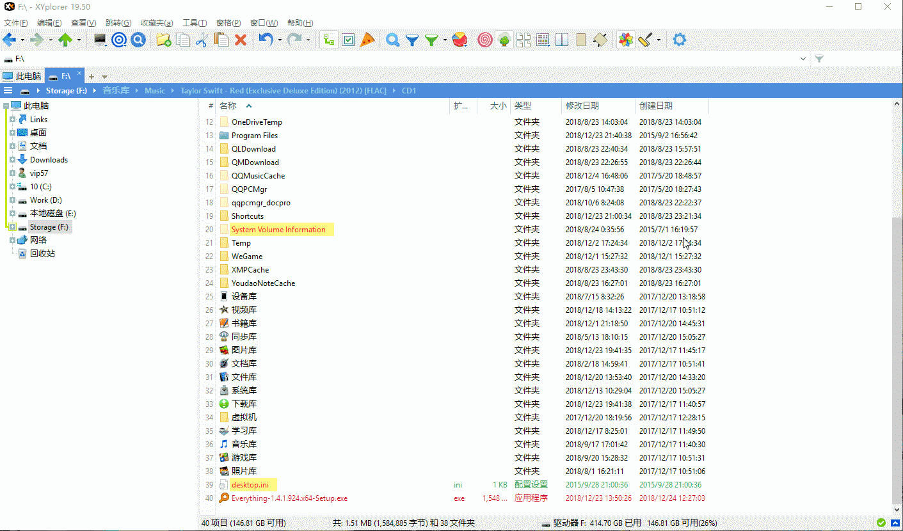


## 文件标注(Label)+标签(Tag)+注释(Comment)
Lable&Tag

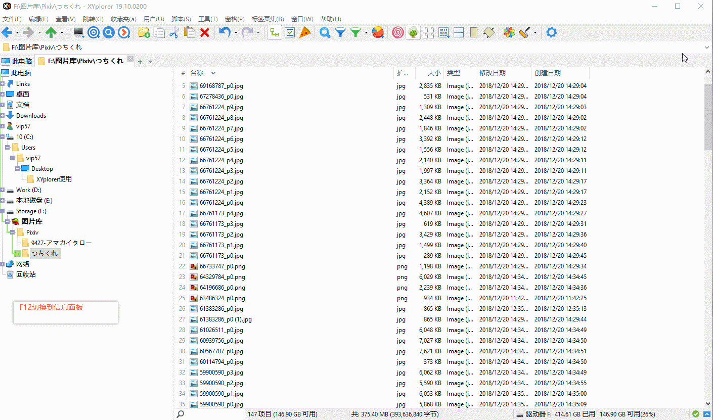


Comment

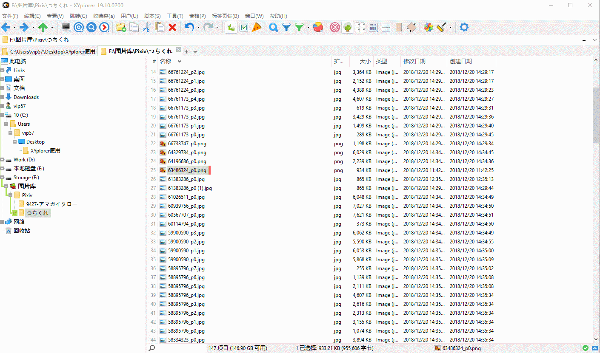


## 颜色过滤(Color Filters)
文件数目多，合理在设置中对各格式文件进行颜色过滤设置，可以方便分辨文件的）


比如我收藏的文件夹都是绿色显示的，树目录也会显示的，隐藏文件好像黄色的彩笔背景色+紫色还是红色（具体看设置）


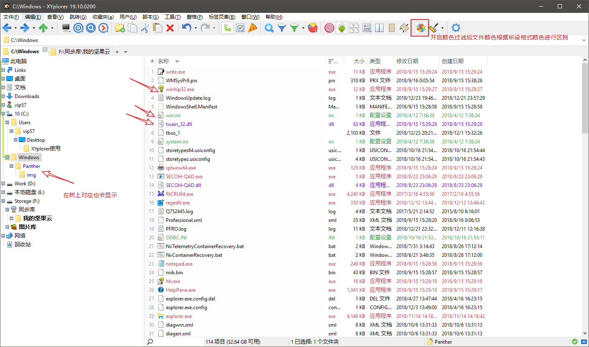


不喜欢绿色背景?
配置->颜色和风格->颜色过滤器：

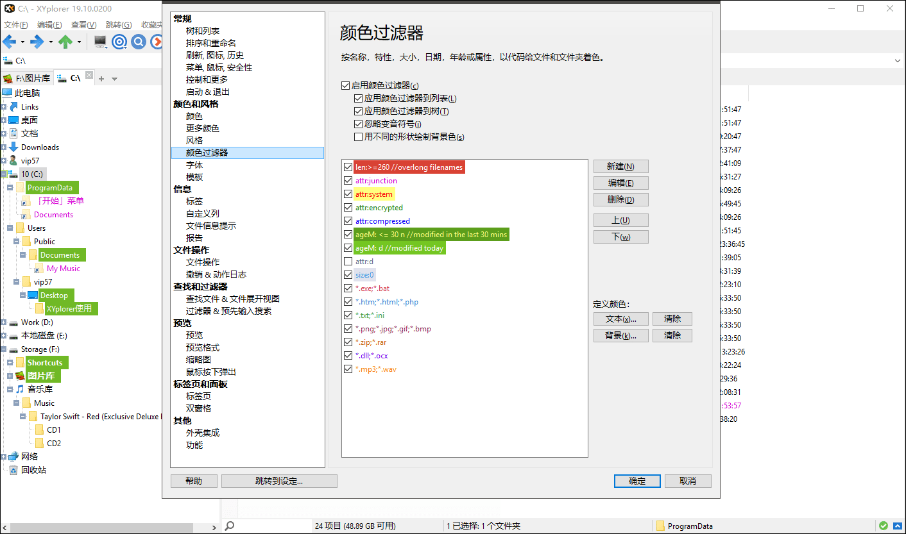

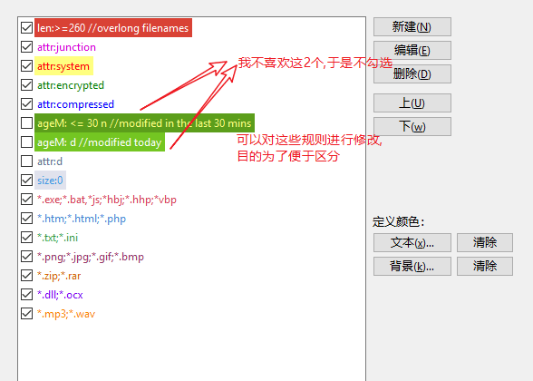


## 收藏文件夹以及快速切换到收藏的文件夹
基于这样一个使用背景：我想收藏`F:\同步库\我的坚果云`目录，在需要使用的时候快速切换到该目录

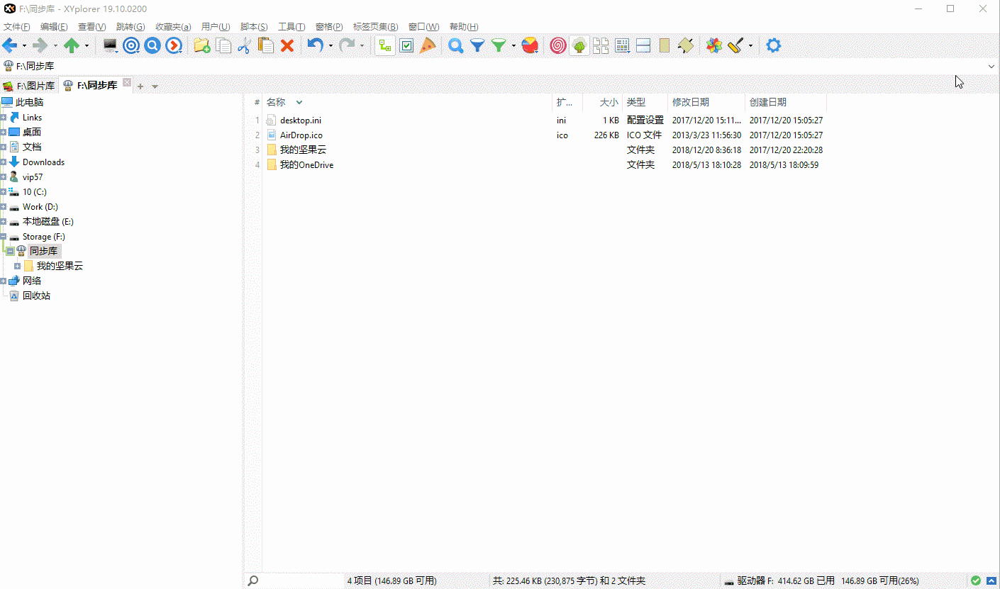


没错，居然按CTRL+B(字体加粗)，这样就收藏了，切换时就在导航面板上鼠标右键->选择文件夹
如果管理收藏夹：在工具栏中，收藏夹->管理收藏夹文件夹


使用存在的问题：
比如我的看图文件是Honeyview.exe,然而我关联我图像格式后，打开还是弹出类似微软的提示选择格式框，这是该怎么办呢？

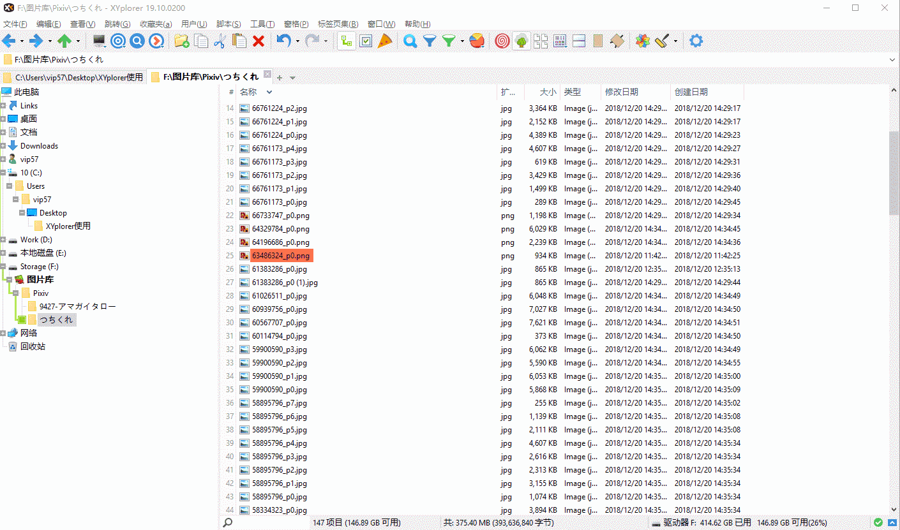

解决的方法是：看下面的说明吧


## 特殊的文件关联(File Associations)
工具栏(Tools)->自定义文件关联(Customize File Associations)

添加关联格式语法为`文件格式>文件路径`

不同图像格式之间用`;`隔开(注意;是英文标号的分号，不是中文分号)

例如：

```
{:Image}>C:\Program Files\Honeyview\Honeyview.exe
```

或

```
ani;bmp;gif;ico;jpe;jpeg;jpg;pcx;png;psd;tga;tif;tiff;wmf>C:\Program Files\Honeyview\Honeyview.exe
```

添加如下图：

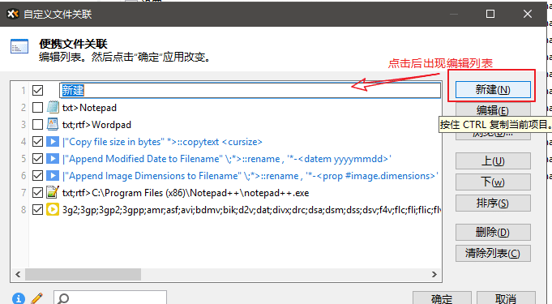


然后点击确定。


类似可以添加的如下：
文本格式：

(2020/11/26)

```
{:Text}>C:\Program Files (x86)\Notepad++\notepad++.exe
```

视频：

```
{:Video}>C:\Program Files\DAUM\PotPlayer\PotPlayerMini64.exe
```

或

```
3g2;3gp;3gp2;3gpp;amr;asf;avi;bdmv;bik;d2v;dat;divx;drc;dsa;dsm;dss;dsv;f4v;flc;fli;flic;flv;ifo;ivf;m1v;m2ts;m2v;m4b;m4p;m4v;mkv;mod;mov;mp2v;mp4;mpe;mpeg;mpg;mpv2;mts;ogm;pss;pva;qt;ram;ratdvd;rm;rmm;rmvb;roq;rpm;smk;swf;tp;tpr;ts;vob;vp6;webm;wm;wmp;wmv>C:\Program Files\DAUM\PotPlayer\PotPlayerMini64.exe
```

其他：自己网上搜比如音乐文件的格式，还是其他文件的格式，然后往>前面添加就行了。


*路径之间按语法格式修改:*
文件格式>文件路径
文件路径的小方法：对着应用软件ICON图标按住SHIFT+鼠标右键就可以看到:

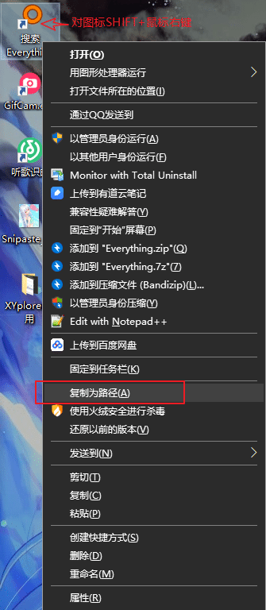


于是出现的下面复制的内容："C:\Users\vip57\Desktop\搜索 Everything.lnk"
你添加文件路径把复制文件路径首尾的双引号”去掉


**这样做的好处？什么？还有好处？**

是的，有好处的，比如你安装了Potplayer，又安装了迅雷影音,结果迅雷影音把视频文件格式设置用迅雷影音打开，那么你用原生的文件管理器肯定双击视频文件后就是用迅雷影音打开。
但是有了视频关联，就不会出现这种问题，只要你是用XYplorer就可以了。
再举个例子：

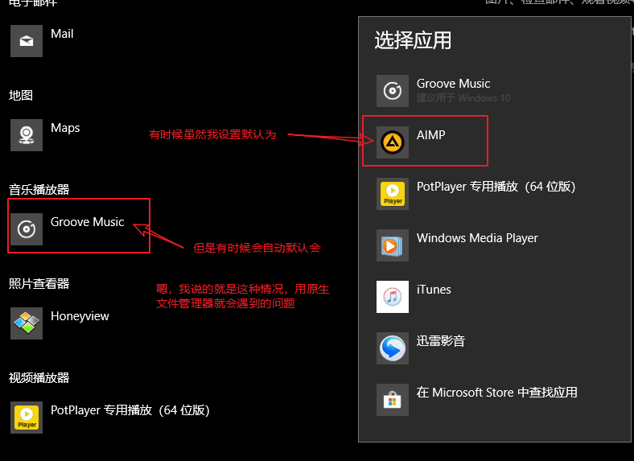


就是这种默认格式重置问题于是我添加了这样一条音乐格式

```
{:Audio}>F:\Program Files\AIMP\AIMP.exe
```

或

```
aac;ac3;aif;aifc;aiff;amr;ape;au;cda;dts;fla;flac;gym;it;m1a;m2a;m3u;m4a;mid;midi;mka;mod;mp2;mp3;mpa;ogg;ogm;ra;rmi;snd;spc;umx;vgm;vgz;voc;wav;wma;xm>F:\Program Files\AIMP\AIMP.exe
```

Perfect！就是这样。不管Window设置中默认设置怎么变，这种window设置的默认是相对原生Explorer来说的，不会影响到XYplorer


## 在地址栏进行搜索/算术
地址栏搜索

a.在活动窗口为XYplorer时，按下快捷键ALT + D进入地址栏

b.打出一个问号?

c.后接搜索内容

d.回车

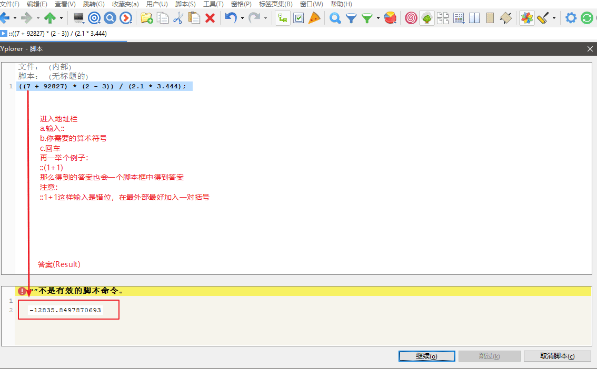


## 搜索功能：重复文件查找
比如我有这么一个文件："F:\下载库\IDMDownloads\Everything-1.4.1.924.x64-Setup.exe"

比如我有这么一个文件"F:\下载库\Downloads\Everything-1.4.1.924.x64-Setup.exe"

我只需要在活动路径为下载库下搜索

搜索重复文件效果如GIF：

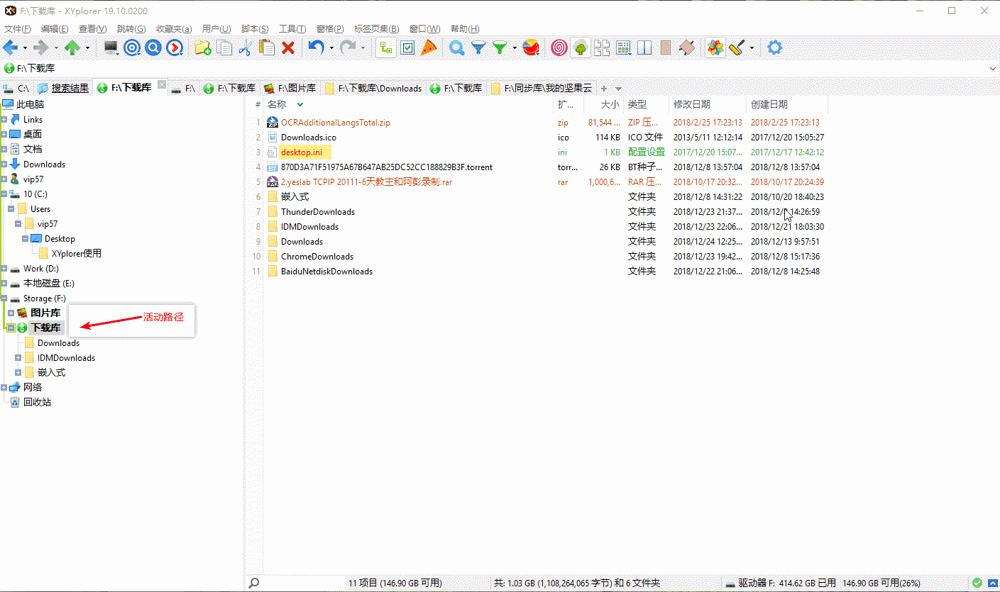

破解版搜索文件变久了后可以会卡。在小范围搜索推荐使用，比如搜索当前文件夹的文件。


搜索技巧：地址栏,输入?+搜索关键字即可快速搜索。

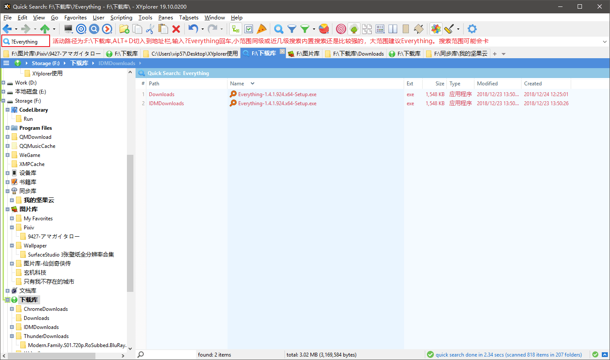


## 路径导航栏(Breadcrumb Bar)
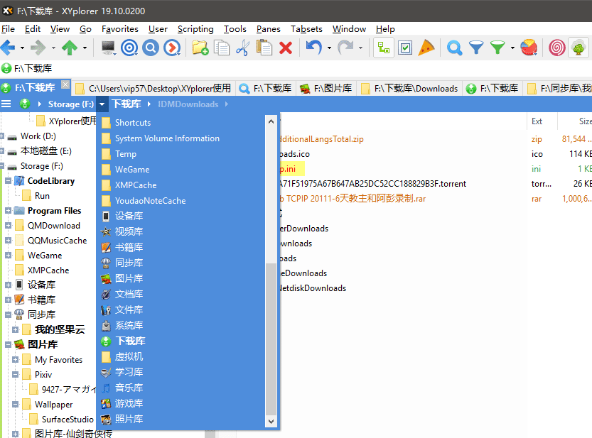


## 常用的快捷操作

| 快捷键                       | 描述                                                     |
| ---------------------------- | -------------------------------------------------------- |
| ALT + T                      | 打开新标签(New Tab)                                      |
| ALT + W                      | 关闭当前标签                                             |
| F6或者ALT + D                | 进入地址栏                                               |
| 在XYplorer空白处双击鼠标左键 | 返回当前文件地址路径的上一级                             |
| CLRL + F                     | 内置搜索栏。配合CLRL + SHIFT + F移动到内置搜索栏的对话框 |
| F8                           | 切换导航面板                                             |
| CLRL + 鼠标移动到图片文件上  | 自动预览图片内容                                         |

好多好多快捷键自己探索吧。


## 如何设置XYplorer?

工具->配置（F9）

(2020/11/22)**方便使用和为了防止删除XY时无法正常使用Windows文件管理器，不建议设置XY为默认文件管理器，但推荐在XY固定到任务栏，并添加到右键菜单**。我在Tips.md中给出了从XY打开Windows文件管理器的方法，这种XY兼顾Windows文件管理器的方式，可以说不存在任何兼容性问题，因此**强烈建议不设置XY为默认文件管理**。

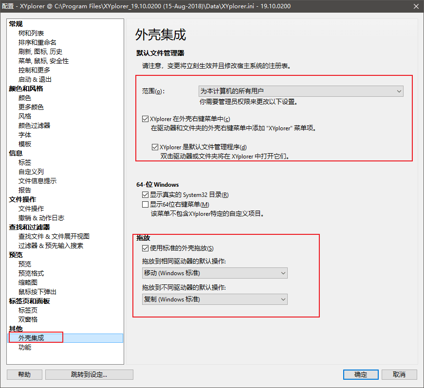

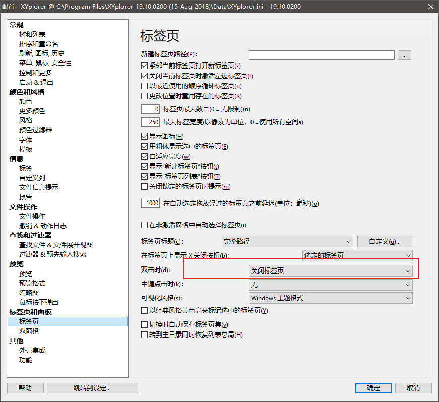

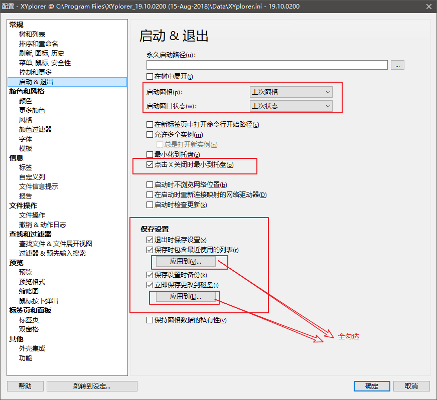

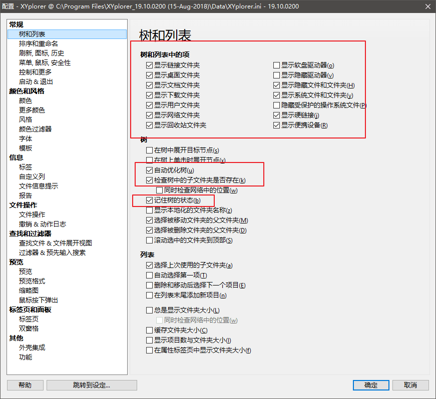

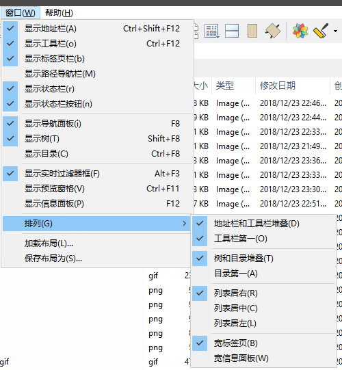

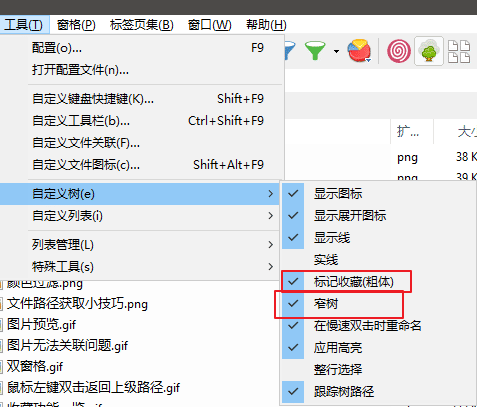

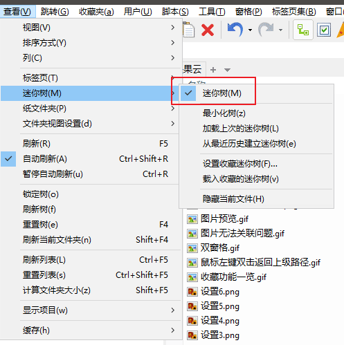


为本计算机的所有用户下要默认文件程序为XYplorer记得一定要开启常驻管理员运行。

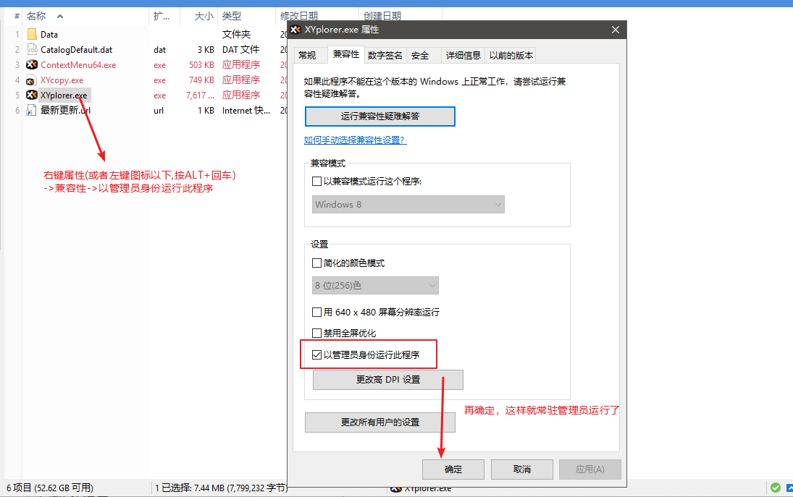


那么用管理员运行有什么好处？(不喜欢看为什么就跳过，不强求)

1. 使XYplorer的全局快捷键在具有管理员权限的窗口也能响应。(活动窗口在非XYplorer时，也能响应XYplorer的全局快捷键)
2. 为所有用户提供XYplorer的使用权限。这意味着你使用Administer用户也可以使用XYplorer。
3. 涉及修改(Modify)C盘相关文件操作的命令可以被安全，正常地执行。


## 备份与还原

启动&退出->保存设置，这样设置有什么用呢？

如果你要重装系统或者换个新版本的XYplorer，这时候就可以把配置文件先保存起来：


*备份步骤如下*：

-(2020/11/22)请选择“备份应用程序数据文件夹” - 该选项其实就是备份XY/Data目录。

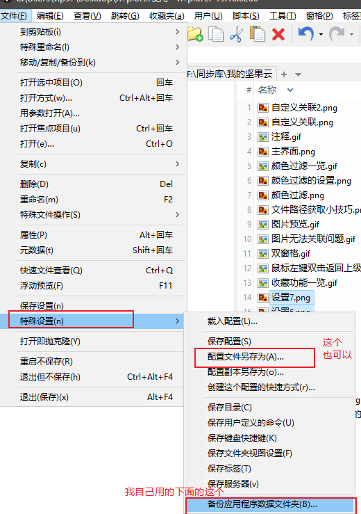

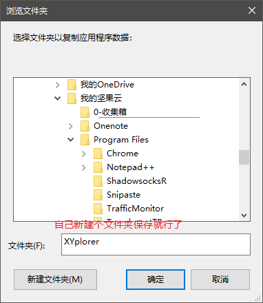


*还原备份*：

(2020/11/22)还原请按如下步骤进行：(程序要常驻使用管理员身份运行)

1. **把旧版本删除前，进入配置(F9)->其他->外壳集成->XYplorer是默认文件管理器勾选取消。** 一定要取消，不然要全靠Windows文件管理器上的地址栏输入路径来进入文件夹。

2. 在第1步骤后，一定要备份Data目录。然后删除旧的XYplorer

3. 新的XYplorer解压到你想要放到的目录

4. (极其重要)将备份的Data文件夹目录中的XYplorer.ini修改为MyXYConfig.ini。

   注：为了避免覆盖新XY目录的XYplorer.ini，请确保备份的Data目录的XYplorer.ini命名为MyXYConfig.ini，当然你也可以取其他名称。

5. 复制这个备份的Data, 粘贴到新的XY目录下，对Data目录进行替换。

6. 打开新XY，然后在菜单栏`文件->特殊设置->载入设置`->选择MyXYConfig.ini文件导入。OK

(2020/11/22)载入图片如下(这里请选择MyXYConfig.ini)

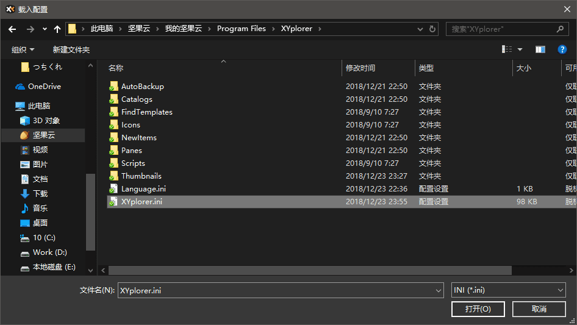

还原效果测试：

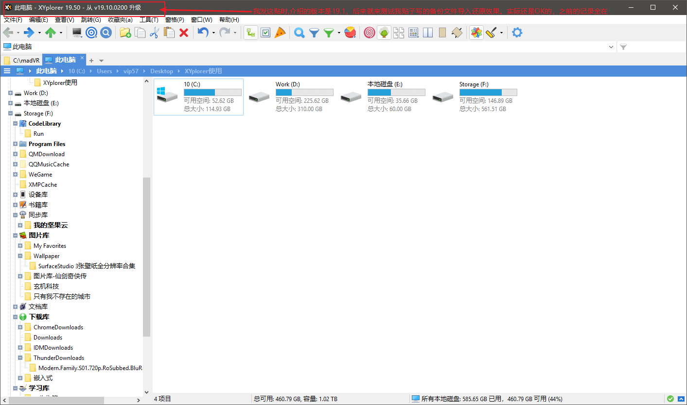


# 补充

## 启动XYplorer的全局快捷键的小技巧

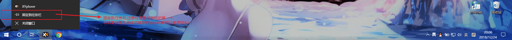

(2020/11/22)关于<kbd>Win+E</kbd>替换为XY的方法请参考[修改Win+E链接到XYplorer.md](./Updates/修改Win+E链接到XYplorer.md)


## 夜间模式

2018/12/25 - 新增特性：夜间模式(Dark Mode)

该功能在XY 19.50版本可用

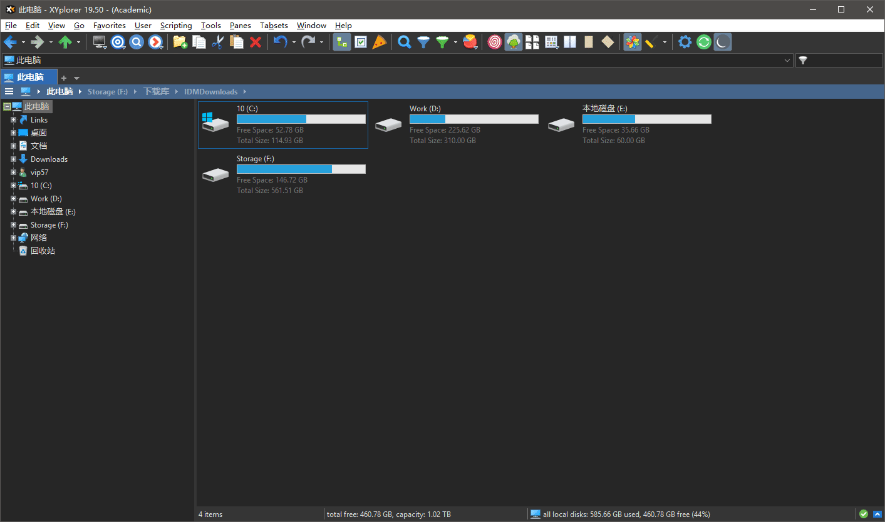

在工具栏"夜间模式"按钮的添加方式如GIF图所示：

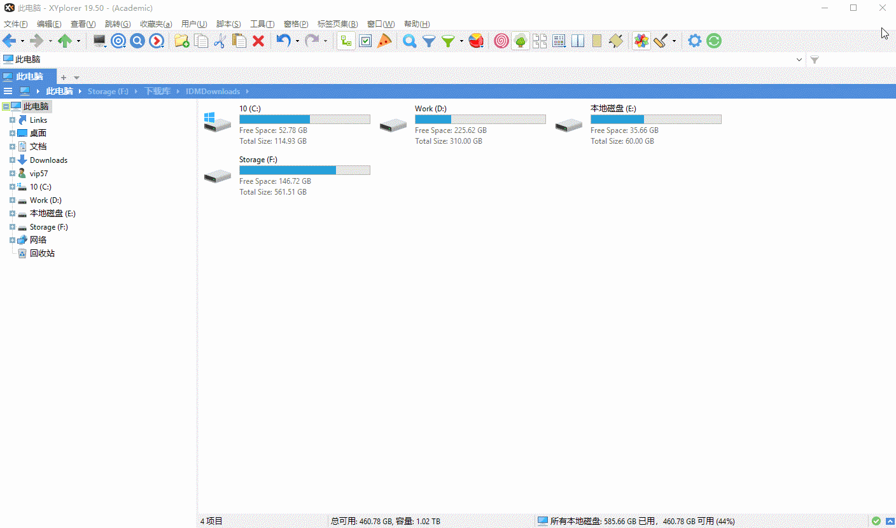


## 文件由列表列宽过小而导致文件参数显示不全的问题

2018/12/26 - 文件由列表列宽过小而导致文件参数显示不全的问题

解决方法

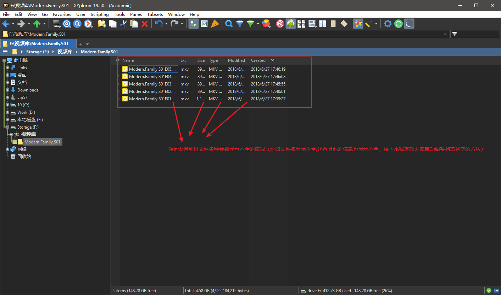


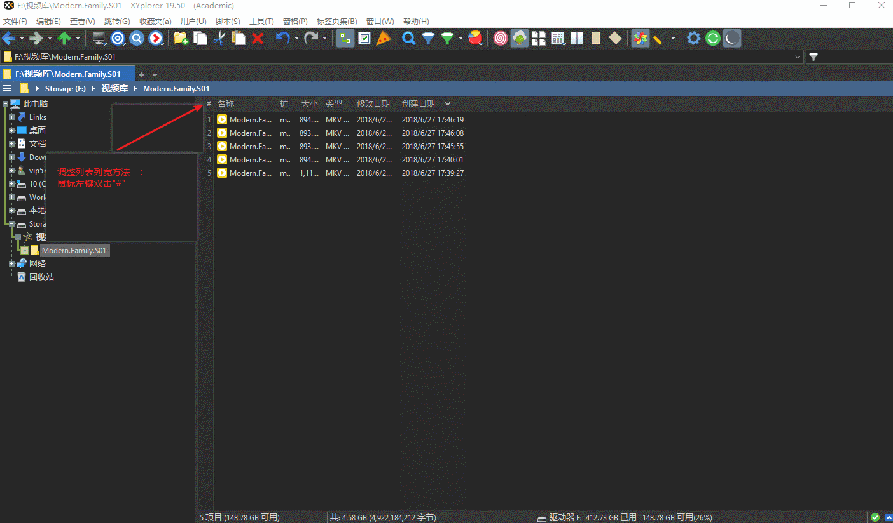


## 纸文件夹(Paper Folders)

纸文件夹方便集中管理各种文件路径。支持历史，最近文件夹，活动表，标签页，目录，收藏夹，文件(可执行应用；视频文件；音频文件；图像文件等) 。

你可以拿纸文件夹集中管理比如"制作一份视频"或者"一份程序解决方案"所需的材料清单。(多种项目方案材料都可以集中管理。)

- 菜单栏->查看->纸文件夹

- 添加纸文件夹到工具栏

  对工具栏右键自定义工具栏，如图所示

  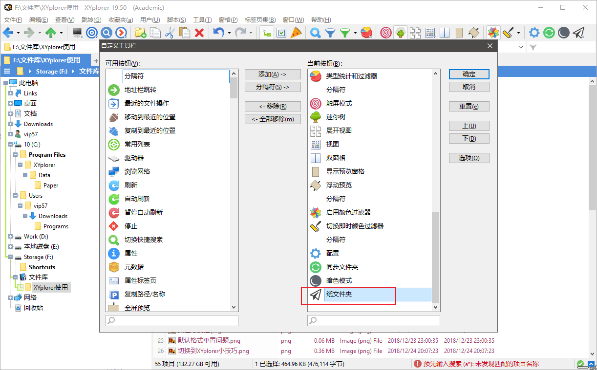

### 快速创建纸文件夹

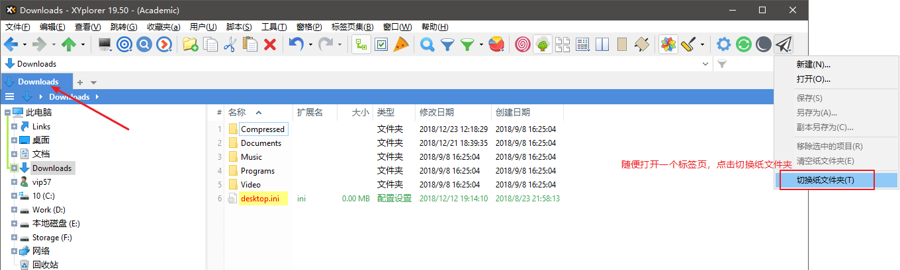

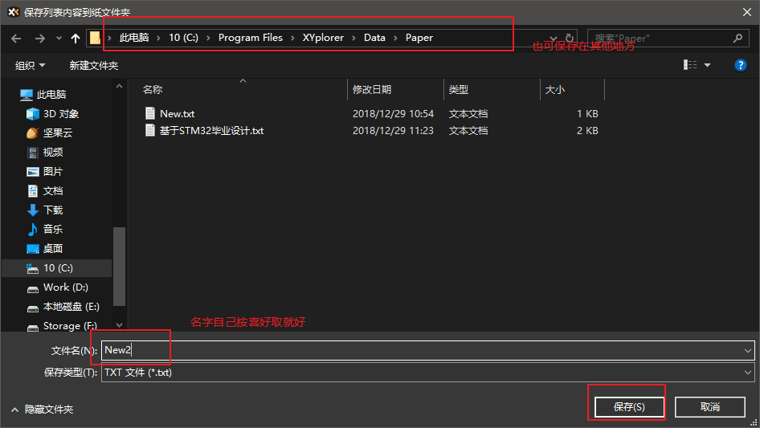

Paper Folder是一个以`.txt`结尾的文本文件，可以通过记事本工具编辑它。

### 编辑纸文件夹

步骤：使用记事本打开New2.txt。（楼主使用的是Notepad++）

规则：

编辑纸文件夹可以使用文件路径。文件路径可以是历史，最近文件夹，活动表，标签页，目录，收藏夹，文件(可执行应用；视频文件；音频文件；图像文件等) 

有些软件的Paper Folder支持URI。有些则不支持，有些支持其他特性。这里XYplorer日常使用都是文件路径。其他高级特性不述说。

比如，C:\Users\vip57\Desktop\Keil uVision5.LNK为绝对路径（包括盘符的绝对路径），这种绝对路径XYplorer是支持的，但，不可以使用不包含盘符的特殊绝对路径，比如：

\Users\vip57\Desktop\FlyMcu.exe.lnk

举例：

比如，我添加一个目录F:\Shortcuts和一个应用程序的快捷方式C:\Users\vip57\Desktop\Keil uVision5.LNK

如图：

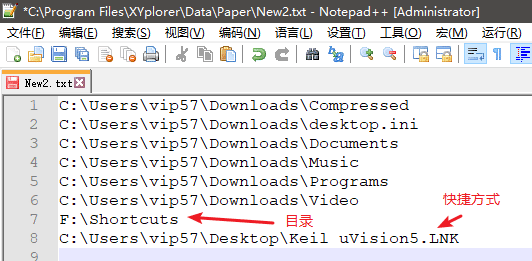


保存文件，然后退出记事本。这点很重要。(这样可以释放你编辑的这个文件的使用权)

然后点击纸文件夹工具栏，打开->New2.txt

如图：

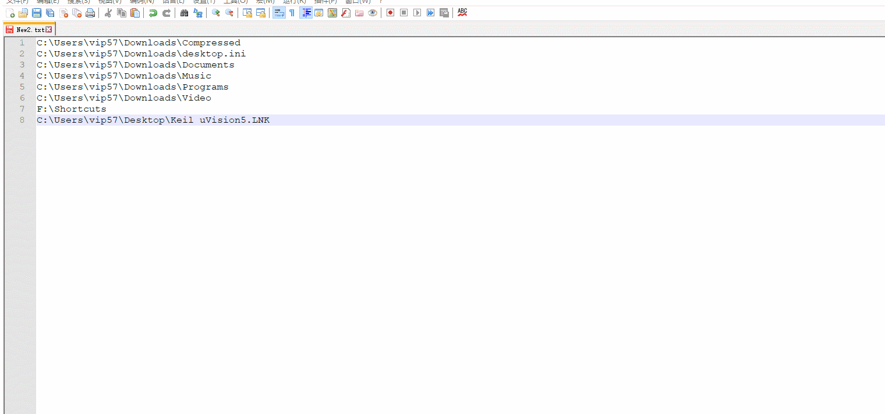

这是我们就可以看到添加的目录和快捷方式。

### 收藏纸文件夹

如图：

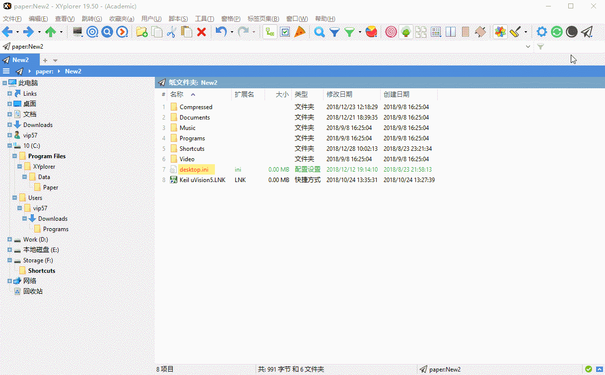


### 后期维护纸文件夹维护

New2.txt的纸文件夹就是编辑这个New2.txt

你可以把不想要的文件路径添加/删除/更新。这个维护很容易我就不解释了。那么我来说明下纸文件夹的好处！请看接下来的应用案例。

<!-- endtab -->


### 应用案例

下面给出两个应用案例

基于STM32的毕业设计

比如，我需要完成一个毕业设计，我需要做下列事情：

- 我需要程序源码以获得参考例子
- 我需要查阅摄像头资料
- 我需要管理"Labview-TCP与单片机通信"项目文件
- 我需要管理"红外遥控器(REMOTE)"项目文件
- 我需要浏览"阿波罗STM32F4&F7 视频盘(D盘)"的视频进行学习
- 我需要管理"基于Labview小车无线控制"的项目
- 我需要参考若干.pdf文档
- 我需要参阅引脚分配表.xlsx

如图：

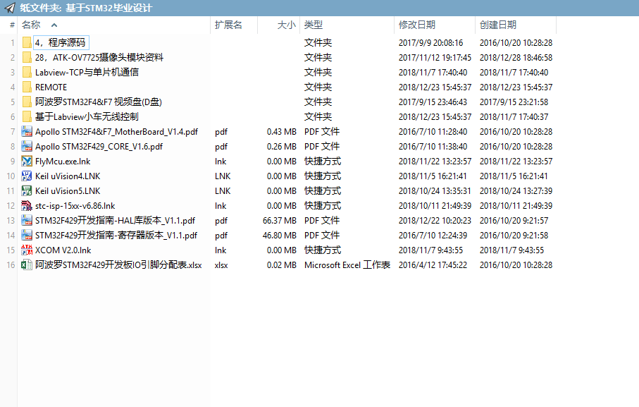

这样就方便我管理毕业设计项目，同时，如果标签页不够，可以ALT+T打开多个同样的纸文件夹。

----

制作一个班级人员展示的视频

假设这个Project需要长时间的制作。给出材料清单

* F:\图片库\Class 路径下的图像文件
* F:\视频库\Class 路径下每个成员的视频介绍
* F:\文件库\Class\Text 路径下每个成员的文本介绍
* F:\音乐库\Class 路径各种背景音乐或者其他需要的Audio
* F:\图片库\Class\ICO 各种ICO文件
* C:\Program Files\<制作视频所需应用程序的文件夹>*.exe 各种应用程序
* F:\文件库\Class\Favroites 各种网站的URI

你不可能记忆那么多文件的位置，然后依次去打开它们。可以使用纸文件夹管理它们，将这些项目一个一个地变成类似URI的文件路径的形式集中归入纸文件夹进行管理。同时，你还可以进行items更新、添加或删除。而你打开这个纸文件。

只需打开切换收藏夹->相关的纸文件夹即可进入某个纸文件夹。


## 展开视图(Branch View)

F:\a1\a2\a3\a4\a5\a6\a7\a8\text.txt

打开这个text.txt难道要打开一层又一层文件夹，到最后一层才能打开吗？
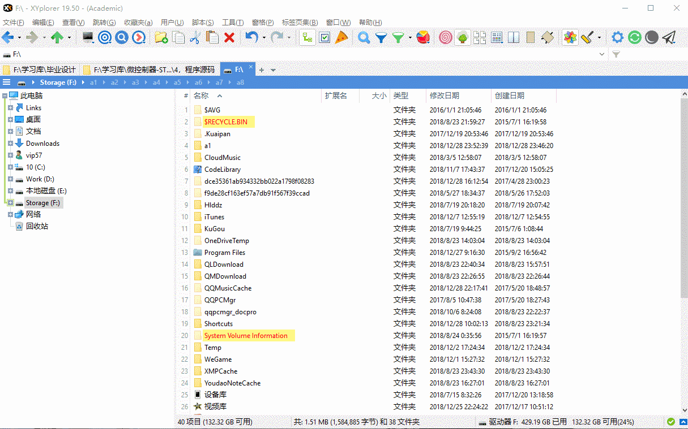


